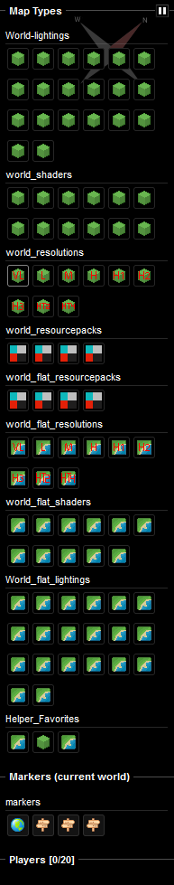
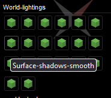
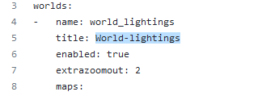
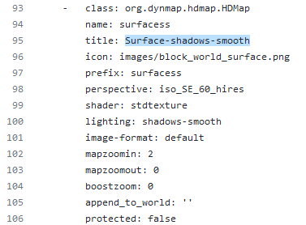

# 示例配置与网站

本页包含了指向 Github 仓库与示例网站的 Dynmap 链接。

## 示例网站

如果你想详细了解 Dynmap 在力所能及的范围内的渲染样式，你可以打开如下链接进行浏览。

[网站链接](https://dynmap-setup.jurgenmk.nl/)。

## 右侧菜单



鼠标悬停在任意地图类型上即可浏览其名称：



在分区名称及地图类型名称的帮助下可以快速找到 Github 仓库中的对应配置，我们稍后会进一步讲述。

## 示例配置

所有上述网站的配置都可以在 Github 的这个页面找到：[示例配置仓库](https://github.com/JurgenKuyper/Dynmap-setup/)。

如何搜索示例页里的对应设置？非常简单。

以上述部分设置为例，我们需要找到地图定义“Surface-shadows-smooth”中的世界“World-Lightings”配置。

首先，打开 [`worlds.txt`](https://github.com/JurgenKuyper/Dynmap-setup/blob/master/worlds.txt) 文件。

之后，搜索世界名称，在这里就是“World-Lightings”，应该只会找到一个结果。这时你就来到了世界定义部分，下面就是所有不同渲染器的状态设置。



现在搜索地图定义：



你需要将一整个“class: org.dynmap.hdmap.HDMap”部分复制到你自己的世界配置文件里。

再举一个例子，如果需要把它复制到你的“OverworldOne”里，改后的配置文件如下：

``` YAML
worlds:
# 名称即为你的地图名称（注意大小写）
-   name: OverworldOne
    # 标题会在右侧菜单的类别标题上显示
    title: "OverOne Render"
    enabled: true
    extrazoomout: 2
    maps:
    -   class: org.dynmap.hdmap.HDMap
        # 名称不能重复！不会显示
        name: OOSurface
        # 标题会在右侧菜单鼠标悬浮其上时显示
        title: Surface-shadows-smooth
        icon: images/block_world_surface.png
        # 前缀也不能重复！不会显示
        prefix: OOSurface
        perspective: iso_SE_60_hires
        shader: stdtexture
        lighting: shadows-smooth
        image-format: default
        mapzoomin: 2
        mapzoomout: 0
        boostzoom: 0
        append_to_world: ''
        protected: false
```