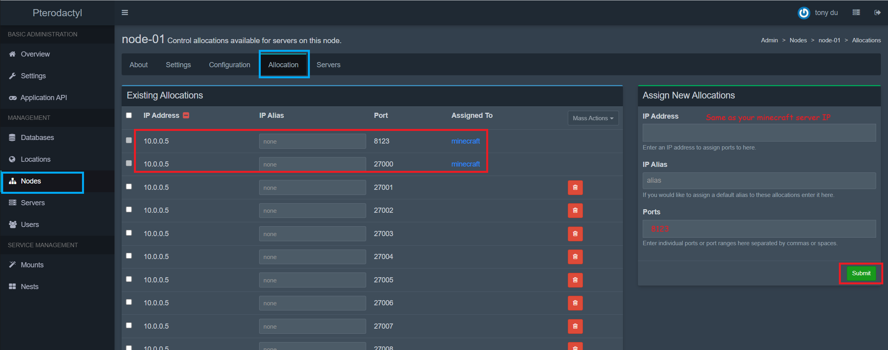
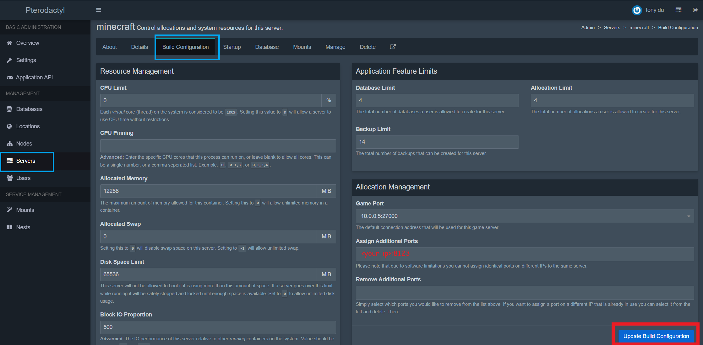
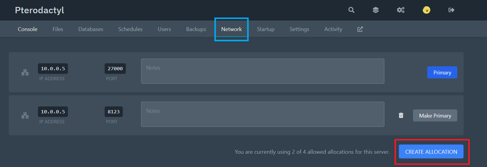
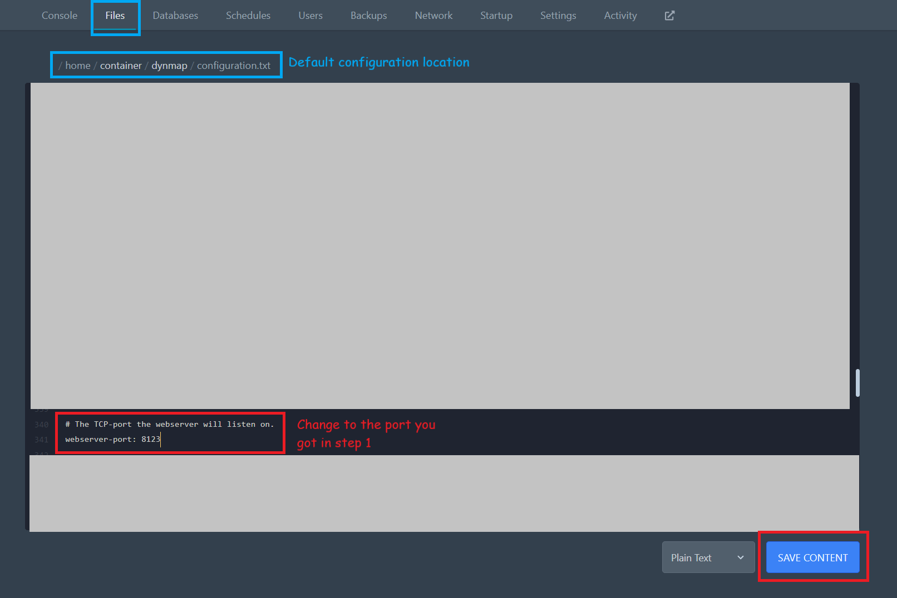

# 通过翼龙面板使用 Dynmap

## 管理员

1. 分配 Minecraft 服务器所在的端口号，Dynmap 的默认端口号为 8123。请按实际情况修改端口号。



2. 分配 Minecraft 服务器的端口：



## 普通用户

1. 分配端口并记录。



2. 通过这个端口，编辑 `configuration.txt` 下的 `webserver-port`。



## 问题排查

* 确保你在添加服务器时选择了正确的 IP 地址。
* 确保端口开放（无防火墙或路由规则阻止）。可在 shell 中通过 `nc -vzw 10 <服务器IP> <Dynmap端口号>` 测试网络连通性。

若节点可以使用 SSH，

* 尝试输入命令，检查列出的 IP 是否与 Minecraft 服务器的相同。

``` bash
docker ps -f "label=Service=Pterodactyl" --format='table {{.ID}}\t{{.Image}}\t{{.Ports}}'
```

``` txt
CONTAINER ID   IMAGE                               PORTS
05878da27e13   ghcr.io/pterodactyl/yolks:java_17   10.0.0.5:8123->8123/tcp, 10.0.0.5:8123->8123/udp, 10.0.0.5:27000->27000/tcp, 10.0.0.5:27000->27000/udp
```

如下步骤只能排查 Dynmap 运行失败或遇到错误的问题。大部分情况下是地址与端口号分配错误，在此之前应该先检查是否填写正确。

* 若端口匹配正确，在 SSH 中输入命令 `curl -L <服务器IP> <Dynmap端口>` 测试 Dynmap 服务是否运行。
* 若无法在 SSH 会话中访问 Dynmap 服务，你可以试着输入命令 `docker exec <容器ID> curl localhost:<Dynmap端口>`。
* 若还是失败，那么 Dynmap 没有处于运行状态，或遇到了错误。此时你需要浏览通用问题排查部分寻找解决方法。