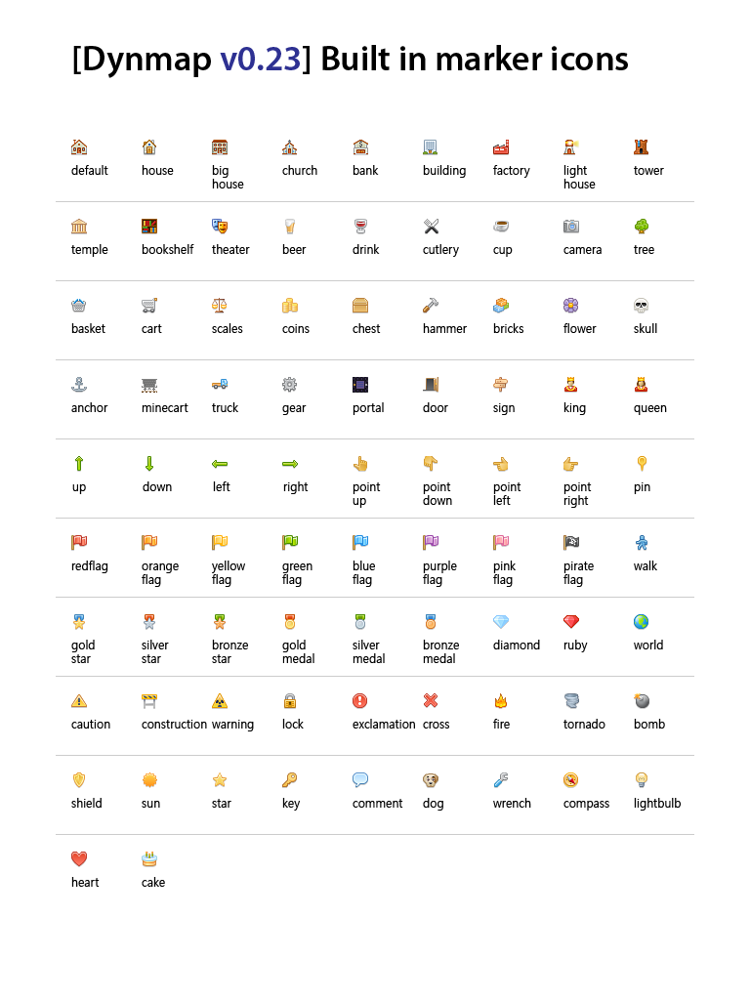

# 标记点用法

Dynmap 支持在地图的原本渲染内容之上增添新的组件。它一般指标记点（Markers），包含标记（图标）、标记区域及多段线标记。

## 标记点组

标点以集合的方式收纳与组织，即标记点组（Marker Sets）。每组标点都有自己的标签，可通过网页客户端的层级选择器选中。每个标记点都有特定的标记点组。插件自带一个标记点组，即“Markers”标签，用于指代不属于任何分组的标记点。删除标记点组会一并删除组内包含的所有标记点。

可以通过 `/dmarker addset <标记点组标签> <标记点组名称>` 或 `/dmarker addset id: <标记点组 ID> <标记点组名称>` 命令新建标记点组。多出的参数可以用来详细设置标记组：

* `prio: <数字>` 用于决定它在层级选择器中相对其他组别的顺序；
* `hide: <true/false>` 用于决定它是否默认在地图上可见；
* `minzoom: <数字>` 用于决定它在小于指定缩放等级之前隐藏。

可以通过 `/dmarker updateset <标记点组标签> <标记点组名称>` 或 `/dmarker updateset id: <标记点组 ID> <标记点组名称>` 命令修改现存的标记点组。同样支持上述的 `prio:<数字>`、`hide:<true/false>` 参数，另外还有一个 `newlabel:<修改后的标签名称>` 参数可以用来修改标签名称。

在 0.32 版本后，新增了 `showlabels:<true/false/null>` 参数。这个设置可以显示或隐藏标记点标签（隐藏时只会在鼠标靠近时显示标签）。`null` 表示全局默认值（在 `configuration.txt` 下标记点组件部分的 `showlabels` 处设置）。

标记点组（除了默认的标记点组“Markers”）都可以用命令 `/dmarker deleteset <标记点组标签> <标记点组名称>` 或 `/dmarker deleteset id: <标记点组 ID> <标记点组名称>` 删除。

## 标记点

标记点是最普通的地图标记——一个图标搭配标签，以及相关的描述。每个标记都在世界上有对应位置（XYZ 坐标，及所在世界的 ID），一个标记图标 ID，以及一段可选描述。标记图标 ID 可以在标准标记 ID 列表中浏览（稍后会显示），或者对应其他已载入的图标（见下文“标记图标”部分）。

标记可以通过如下命令新建：

* `/dmarker add <标记点标签> icon:<图标 ID> set:<标记点组 ID> <标记点组名称>` - 必须在游戏内输入，在玩家所处位置新建一个标记点。如果不填标记点组 ID，那么它会进入默认分组，即“Markers”。若不填图标 ID，则使用默认图标（“房屋”）。
* `/dmarker add id:<标记点 ID> <标记点标签> icon:<图标 ID> set:<标记点组 ID> <标记点组名称> x:<x 轴坐标> y:<y 轴坐标> z:<z 轴坐标> world:<世界名称>` - 作用同上，但为标记设置了 ID，且可通过控制台执行。
* `使用告示牌`：若标记点组件的 `enablesigns` 设置开启，那么玩家可以在拥有适当权限（`dynmap.marker.sign`）的前提下创建带有告示牌标签的标记点。告示牌的第一行需以 `[dynmap]` 开头。下面几行除了 `set:<标记点组 ID> <标记点组名称>`（用于将标记点归为指定组别）或 `icon:<图标 ID>`（允许玩家设置标记点图标，未设置时为“告示牌”图标）之外的内容都会当做标记点的描述文本。成功创建以后，告示牌上的 `[dynmap]`、`set:` 以及 `icon:` 参数会消失。若之后破坏告示牌，对应的标记点也会一并消失。

创建之后，标记点可以通过如下命令编辑：

* `/dmarker movehere <标记点标签> set:<标记点组 ID> <标记点组名称>` 或 `/dmarker movehere id:<标记点 ID> set:<标记点组 ID> <标记点组名称>`：将现有标记点移动到玩家所在位置。注意：若需要选择不在默认标记点组（“Markers”）中的标记点，必须填入 `标记点组 ID` 参数。
* `/dmarker update <标记点标签> set:<标记点组 ID> <标记点组名称> icon:<图标 ID> newlabel:<新标签>` 或 `/dmarker update id:<标记点 ID> set:<标记点组 ID> <标记点组名称> icon:<图标 ID> newlabel:<新标签>`。注意：若需要选择不在默认标记点组（“Markers”）中的标记点，必须填入 `标记点组 ID` 参数——默认标记点组本身的名字无法更改。

如果需要给标记点添加描述，首先需要用 `/dmarker resetdesc id:<标记点 ID> set:<组别 ID>` 重置标记点的描述，然后再通过命令 `/dmarker appenddesc id:<标记点 ID> set:<组别 ID> desc:"<标记点描述>"` 为其增加描述。确保描述部分用英文双引号（`""`）包裹。

标记点可以通过 `/dmarker delete <标记点标签></marker> set:<标记点组 ID> <标记点组名称>` 或 `/dmarker delete id:<标记点 ID> set:<标记点组 ID> <标记点组名称>` 命令删除。

现存的标记点组以及它们的属性可通过命令 `/dmarker listsets` 浏览。

现存的标记点以及它们的属性则可通过命令 `/dmarker list set:<标记点组 ID> <标记点组名称>` 浏览。

## 标记点图标

标记点图标是用于显示标注标记点的图片资源。Dynmap 自带一个标准的图标包，详见下图，总是可以使用与设置，且无法删除。完整图标列表可在游戏内通过 `/dmarker icons` 命令浏览。

新图标可通过如下方式安装：

* 复制 PNG 格式的图片，放入 Bukkit 服务器的文件系统。图片的边长应该为 8、16 或 32 像素。
* 输入命令 `/dmarker addicon id:<图标 ID> <图标标签> file:<指向图片的路径>`——如果命令执行完成，那么图标就算导入成功（不需要留在原本复制的地方）。

若要更新现存图标的样式，只需输入命令 `/dmarker updateicon id:<图标 ID> newlabel:<新标签> file:<指向图片的路径>` 即可。

若要删除现存图标，只需输入命令 `/dmarker deleteicon id:<图标 ID>` 即可。

## 区域标记

区域标记可以在地图上描绘出平面或立体范围。通过两组以上 XZ 轴坐标的区域标记形成的闭合区域，形状一般为矩形（只设置两点的情况下，以两点连线为对角线构成的矩形）或多边形（设置三个以上点，首尾相连构成的图形）。另外，可以提供 Y 值的上下限，将平面图形扩展为立体范围（顶面与底面水平）。

区域的边框属性有颜色（HEX 格式：RRGGBB）、描边宽度及不透明度。内部区域的属性则有填充色（HEX 格式：RRGGBB）及填充不透明度。

创建区域前需要先设置角点。可以这样：

* 输入 `/dmarker addcorner` 在玩家所处位置插下角点。
* 输入 `/dmarker addcorner <x> <y> <z>` 或 `/dmarker addcorner <x> <y> <z> <世界名称>` 在指定位置插下角点。

若需要，还可以输入命令 `/dmarker cleancorners` 清除插下的所有角点。

插入所有角点后，可通过 `/dmarker addarea set:<标记点组 ID> <标记点组名称>` 或 `/dmarker addarea id:<标记点 ID> set:<标记点组 ID> <标记点组名称>` 设置区域。这些命令可以设置额外参数，或者之后也可以用 `/dmarker updatearea id:<标记点 ID> set:<标记点组 ID> <标记点组名称>` 或 `/dmarker updatearea set:<标记点组 ID> <标记点组名称> newset:<新标记点组 ID>` 命令追加。完整设置如下：

* `color` - 边框颜色（`color:RRGGBB`）
* `fillcolor` - 填充颜色（边框范围内的颜色）（`fillcolor:RRGGBB`）
* `opacity` - 边框不透明度（`0.0` = 完全透明，`1.0` = 不透明）
* `fillopacity` - 填充不透明度（`0.0` = 完全透明，`1.0` = 不透明）
* `weight` - 边框宽度（`0` = 最细，值越高越粗）
* `ytop` - 区域顶部上限（默认为 64）
* `ybottom` - 区域底部下限（默认为 64）

::: info 注意

现存区域的边角目前无法更新——只能删除当前区域重新创建解决。另外，角点列表会在通过命令 `/dmarker addarea` 创建区域后清空。

:::

若要删除现有的区域标记点，输入命令 `/dmarker deletearea id:<标记点 ID> set:<标记点组 ID> <标记点组名称>` 即可。

现存区域及其属性可通过 `/dmarker listareas set:<标记点组 ID> <标记点组名称>` 命令浏览。

## 圆形标记

圆形标记用于在地图上显示平面圆形（或椭圆形）区域。区域由中心点（xyz 坐标）及半径（通过 `radius` 参数指定）或 X 与 Z 轴的半径（椭圆，通过 `radiusx` 和 `radiusz` 参数指定）。

圆形区域的边框属性有颜色（HEX 格式：RRGGBB）、描边宽度及不透明度。内部区域的属性则有填充色（HEX 格式：RRGGBB）及填充不透明度。

圆形标记点可通过 `/dmarker addcircle <圆形区域标签> set:<标记点组 ID> <标记点组名称>` 或 `/dmarker addcircle id:<圆形区域 ID> <圆形区域标签> set:<标记点组 ID> <标记点组名称>` 命令创建。这些命令可以设置额外参数，或者之后也可以用 `/dmarker updatecircle id:<圆形区域 ID> set:<标记点组 ID> <标记点组名称>` 或 `/dmarker updatecircle <圆形区域标签> set:<标记点组 ID> <标记点组名称>` 命令追加。完整设置如下：

* `x` - 中心点 X 轴坐标（默认为玩家所在位置）
* `y` - 中心点 Y 轴坐标（默认为玩家所在位置）
* `z` - 中心点 Z 轴坐标（默认为玩家所在位置）
* `radius` - 区域半径（默认为 `1`）
* `radiusx` - 区域 X 轴半径（默认为 `1`）
* `radiusy` - 区域 Z 轴半径（默认为 `1`）
* `world` - 世界中心点（默认为玩家所在位置）
* `color` - 边框颜色（格式为 `color:RRGGBB`）
* `fillcolor` - （边框内区域）填充颜色（格式为 `fillcolor:RRGGBB`）
* `opacity` - 边框不透明度（`0.0` = 完全透明，`1.0` = 不透明）
* `fillopacity` - 填充不透明度（`0.0` = 完全透明，`1.0` = 不透明）
* `weight` - 边框宽度（`0` = 最细，值越高越粗）

若要删除圆形区域，只需输入 `/dmarker deletecircle id:<圆形区域 ID> set:<标记点组 ID> <标记点组名称>` 命令即可。

现存圆形区域及其属性可通过 `/dmarker listcircles set:<标记点组 ID> <标记点组名称>` 命令浏览。

## 多边形标记

多边形标记用于在地图上显示多边形区域。每个多边形标记点都由一或多个 XYZ 坐标表示，带有标签及可选的描述，及相关的边框颜色、宽度和不透明度。

圆形区域的边框属性有颜色（HEX 格式：RRGGBB）、描边宽度（0-N）及不透明度。内部区域的属性则有填充色（HEX 格式：RRGGBB）及填充不透明度（0.0-1.0）。

创建区域前需要先设置角点。可以这样：

* 输入 `/dmarker addcorner` 在玩家所处位置插下角点。
* 输入 `/dmarker addcorner <x> <y> <z>` 或 `/dmarker addcorner <x> <y> <z> <世界名称>` 在指定位置插下角点。

若需要，还可以输入命令 `/dmarker cleancorners` 清除插下的所有角点。

插入所有角点后，可通过 `/dmarker addline <多边形区域标签> set:<标记点组 ID> <标记点组名称>` 或 `/dmarker addline id:<多边形区域 ID> <多边形区域标签> set:<标记点组 ID> <标记点组名称>` 设置区域。这些命令可以设置额外参数，或者之后也可以用 `/dmarker updateline id:<多边形区域 ID> set:<标记点组 ID> <标记点组名称>` 或 `/dmarker updateline <多边形区域标签> set:<标记点组 ID> <标记点组名称>` 命令追加。完整设置如下：

* `color` - 边框颜色（格式为 `color:RRGGBB`）
* `opacity` - 边框不透明度（`0.0` = 完全透明，`1.0` = 不透明）
* `weight` - 边框宽度（`0` = 最细，值越高越粗）

::: info 注意

现存多边形区域的边角目前无法更新——只能删除当前区域重新创建解决。另外，角点列表会在通过命令 `/dmarker addarea` 创建区域后清空。

:::

若要删除现有的区域标记点，输入命令 `/dmarker deleteline id:<多边形区域 ID> set:<标记点组 ID> <标记点组名称>` 即可。

现存区域及其属性可通过 `/dmarker listlines set:<标记点组 ID> <标记点组名称>` 命令浏览。