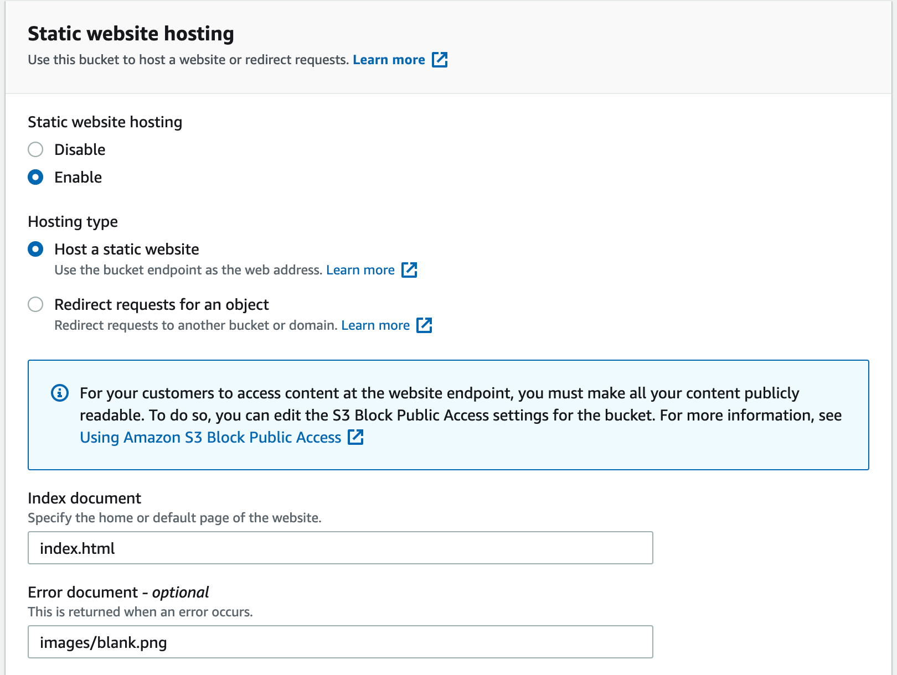
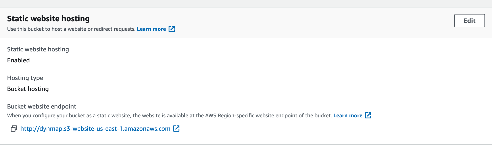
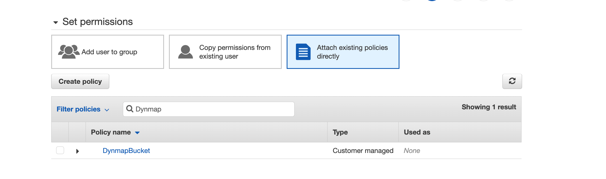
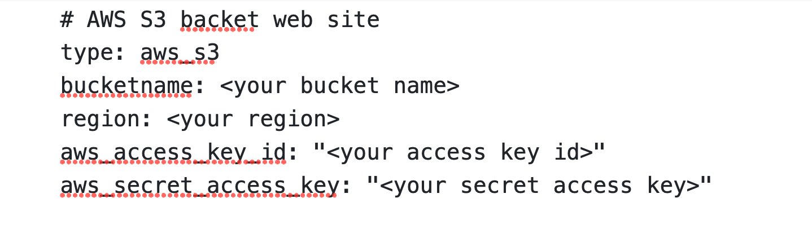
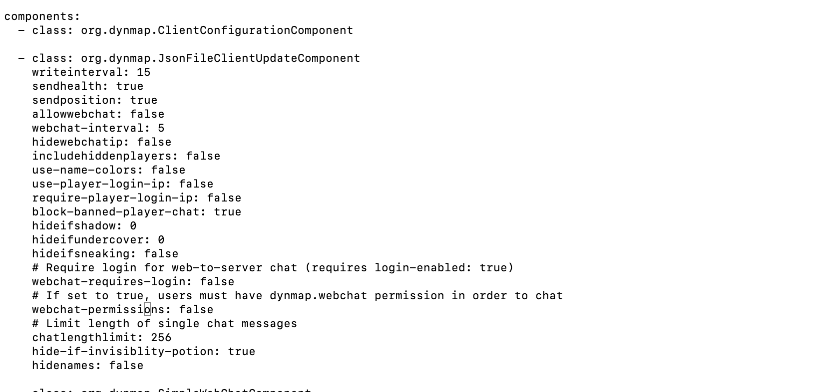
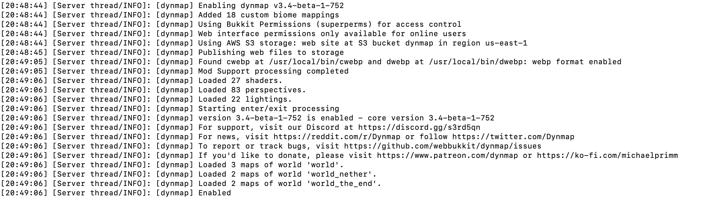

# AWS S3 对象存储

既可以用作存储，也可以用作外置网页服务器，允许地图数据在 AWS S3“存储桶”中的推送及拉取，适用于需要大型本地存储和/或额外内置网页服务器 TCP/IP 端口，却受限于托管环境而无法获得的服务器。

为了设置这个存储，服务器管理员需要拥有一个 AWS（即亚马逊云计算服务，Amazon Web Services）账号。除此之外，也可以使用其他兼容 S3 的服务器（见下）

## 亚马逊 AWS 配置

注意：虽然新注册账户拥有“免费套餐”，允许至多托管一年（12 个月）的 5GB 数据，但是仍需谨记使用 S3 服务非常昂贵且会逐渐累加。我们会提供一些减轻压力的解决方案，但你仍需理解并熟知这期间产生的任何费用，万不可将其当做免费或毫无风险的方案。

设置 AWS S3 对象存储的步骤如下：

1. 若需要，请自行从 <https://aws.amazon.com/premiumsupport/knowledge-center/create-and-activate-aws-account/> 注册一个账号。

2. 通过你的账户设置一个新的 S3 存储桶，并将其配置为静态网页（见[这篇文章](https://docs.aws.amazon.com/AmazonS3/latest/userguide/WebsiteHosting.html)）。必须选择合适区域（决定了你的 S3 存储桶保存在世界的哪个位置 - 最好选择你附近的区域），之后记住这个区域的 ID（例如，`us-east-1`、`eu-west-1`）（见[这篇文章](https://docs.aws.amazon.com/AWSEC2/latest/UserGuide/using-regions-availability-zones.html#concepts-regions)）。另外，记住你选择的 S3 存储桶名字 - 这个名字不能和区域内的其他存储桶重复。当进入静态网页设置时，请在“索引页设置（Index Document Setting）”中选择 `index.html`，在“错误文档设置（Error Document Setting）”中选择 `images/blank.png`（如果你需要在使用的网址上增加前缀，请正确修改这个设置——详见下文）。最后，不要启用“存储桶版本（Bucket Versioning）”设置，这可能会因为图块和状态数据的频繁更新而极大增加存储数据的量！



3. 记下新配置的 S3 存储桶中“属性（Properties）”一栏的“存储桶网页端点（Bucket Website Endpoint）”地址。这就是网站的默认地址——为了让这个地址看起来更有可读性，你可以为你的 DNS 服务配置 CNAME 记录，使 DNS 域名指向这个存储桶（DNS 配置受到当地 DNS 提供商的影响，因此这个需要你自己解决——每个不同的 DNS 托管商都有自己的文档）。



4. 虽然不是必选项，但非常建议你在账户中创建一个本地 IAM 服务用户 ID，便于服务器上的 Dynmap 使用，还可以分配公开 S3 存储桶数据的最小权限。不要使用 root 账户——任何进入服务器的玩家都可以导致你的账户欠款！你可以按如下步骤解决这个问题：

  * 建议这样设置：

  * 对于 **“选择 AWS 凭据类型（Select AWS credential type）”**，请选择 **“用于程序访问（Programmatic access）”**

  * 在 **“权限设置（Set Permissions）”**部分，选择 **“依赖现有策略（Attach existing policies directly）”**，然后点击 **“新建策略（Create Policy）”**。选择 JSON，然后输入如下 JSON 格式的内容（请将“存储桶名称”替换为你自己设置的存储桶名称）：

    ``` JSON
    { "Version": "2012-10-17", "Statement": [ { "Action": [ "s3:DeleteObject", "s3:GetObject", "s3:ListBucket", "s3:PutObject" ], "Effect": "Allow", "Resource": [ "arn:aws:s3:::YOURBUCKETNAME", "arn:aws:s3:::存储桶名称/*" ] } ] }
    ```

  * 这会给予你的 IAM 账户最低限度的权限，刚好能够访问网页存储桶。当你看到“浏览策略（Review Policy）”时，可填入合适的名称（如“Dynmap 存储桶”）。之后，返回新建的选项卡界面，刷新策略列表，在搜索栏中输入新策略的名称。确保为用户勾选使用这个策略列出的权限。



  * 创建完成后，确保记下“访问密钥 ID”及“秘密访问密钥值”——这些信息只会显示一次，丢失就需要重置它们。这些值需要填入 `aws_access_key_id` 以及 `aws_secret_access_key` 设置中。

5. 现在，打开 configuration.txt，调整存储选项部分：



6. 你也可以顺手完成这些设置：

  * 解除 `JsonFileClientUpdateComponent` 部分的注释，删除或注释 `InternalClientUpdateComponent` 部分。另外，还需将 **allowwebchat** 设置为 **false**（不支持此功能），并建议将 **writeinterval** 设置为 15（或更高），将 **updaterate** 原值的 1000 倍——这会降低聊天、玩家位置及其他数据更新向 S3 存储桶发送的速度（可降低（如下所述）的 API 调用消耗），也可以降低网页用户的浏览器向存储桶收取数据的速度。



  * 非常建议利用新增的 **defaulttilescale** 设置提升图块大小（建议设置为 2）从而减少存储到 S3 中的图块数量。这可以减少用户在屏幕上载入图块所需的 GET 调用次数，并确保带宽占用不变。另外也建议 **image-format** 使用默认设置（`jpg-q90`）或 webp 格式，这样可以减小文件占地（不推荐使用 PNG 格式，这会大幅增加文件大小，以及相关的存储及带宽开销）。

  * 必须通过 **disable-webserver** 设置为 **true** 禁用内置网页服务器。

  * 若需要将多个服务器连接到同一个 S3 存储桶，**前缀（prefix）**设置可以用于读取存储桶指定路径下的文件：即相对于“存储桶网站端点（Bucket Website Endpoint）”（如，**prefix: test123/test** 会返回相对于 `http://dynmap.s3-website-us-east-1.amazonaws.com/test123/test/` 的路径）路径下的服务器地图。设置后，存储桶的**错误文档（Error Document）**设置也应根据前缀的变动相应改变路径（这样其中一个服务器的 **images/blank.png** 就可以被其他服务器引用）。

7. That should be it - restart the server and see if it is able to access the bucket. The server will automatically publish the static web site files from Dynmap to the bucket, marker images, and start using the bucket for publishing files.

7. 就是这样——重启服务器后看看 Dynmap 是否可以正常访问存储桶。服务器会向存储桶自动推送 Dynmap 的静态网页文件、地图图标，并通过存储桶发送文件。



### AWS 价格顾虑

截至目前，如下对应的是使用美国 `us-east-1` 的 AWS 价格表——其他城市的价格或未来时间的此地价格很有可能发生变动（请[见此](https://aws.amazon.com/s3/pricing/)了解详情）。

* S3 存储桶数据保存：$0.023/GB/月
* PUT、COPY、POST、LIST 请求：$0.005/1000 次（用于更新图块、缩放图块，以及汇报更新与聊天栏消息等）
* GET 请求：$0.0004/1000 次 （每个浏览器用户的图块载入请求，以及更新相关请求）
* 存储桶数据转移：$0.09/GB（图块读取、更新读取等。浏览器缓存会减轻这个负担）

好在，进入存储桶的数据不会收取费用（除上述 PUT 外的 API 调用）。

## 替代方案

It is possible to configure dynmap to use most other S3-Compatible storage APIs. Some options are listed below.

可以为 Dynmap 配置其他兼容 S3 存储 API 的服务器。部分选择如下：

* **Cloudflare R2**
  * $0.015/GB/月，$0.0045/1000 次请求，$0.00036/1000 次 GET 请求
  * 出站免费
  * 免费套餐：10 GB/月，1 百万次请求/月，1 千万次 GET 请求/月
* **Backblaze B2**
  * $0.006/GB/月，$0.004/1000 次 LIST、COPY 请求（每日免费额度 2500 次），$0.0004/1000 次 GET 请求（每日免费额度 2500 次）
  * 至多三倍存储量的出站免费，超出部分按 $0.01/GB 收取，免费 PUT/POST 请求
  * 免费套餐：10 GB/月
* **Wasabi**
  * $0.0068/GB/月
  * 出站免费
  * 出站免费及 API 请求受公平使用倡议限制，不适合 Dynmap
  * 30 天免费试用（至多 1 TB）
* **Linode Object Storage**
* **DigitalOcean Spaces**
* 还有更多...

大部分规模较大的服务器提供商基本提供兼容 S3 API 的对象存储，因此你还有更多选择。不过讲述这些服务显然超出了维基的范围，如果你不清楚的话，建议保持使用 AWS。

登录并创建存储桶后，请按下表更新 configuration.txt 中的相关设置。

| 设置项  | 更改为 |
|---------|--------|
| `type`                  | `aws_s3` |
| `bucketname`            | 新建的存储桶名称，默认为 `dynmap` |
| `region`                | 如果你的提供商需要设置区域，那么你可以在这里设置。部分提供商无需设置，那么请将其设为 `""`，表示留空。 |
| `aws_access_key_id`     | 访问密钥 ID |
| `aws_secret_access_key` | 访问密钥 |
| `override_endpoint`     | 提供商的 S3 终端。若设置为 `""`，插件会假设你在使用 AWS 终端，会基于区域设置自动生成 |

配置完成后，你可以参考第六步“[亚马逊 AWS 配置](#aws-s3-对象存储)”了解额外的 Dynmap 配置。