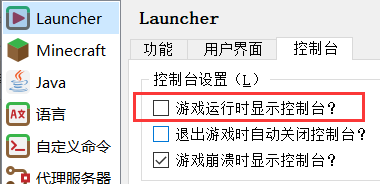
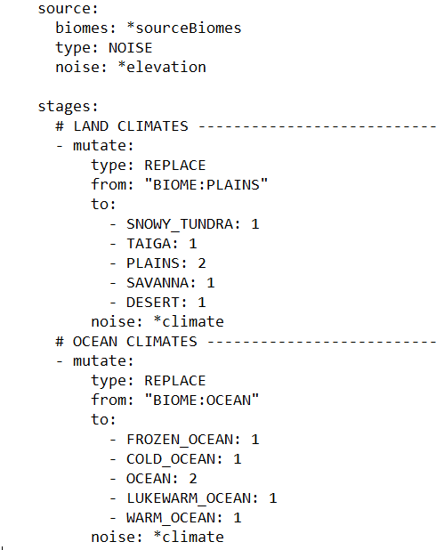
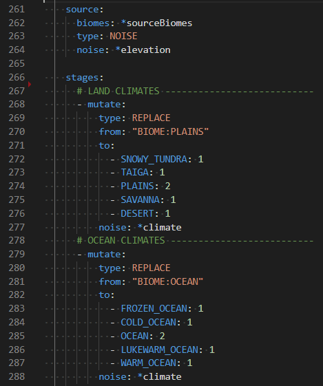

# 配置开发简介

本章节将会大致讲述相关信息，包括在着手开发地形包之前的基础安装步骤。

## 1. 安装测试环境

::: warning

不要在生产环境下部署本教程提及的任何内容。

:::

在着手制作新地形包之前，你将会需要合适的测试用服务器或客户端。我们推荐使用 [Fabric](https://fabricmc.net/) 客户端，但最终这都取决于你。你可以参考[初次使用](../../getting-started/index.md)章节了解如何下载与安装 Terra。

### 打开控制台

在对应平台上运行 Terra 之后，你必须确保你能够打开控制台。这会因你使用的加载器类型而略有不同。我们不会展开讲述如何找到所有平台的控制台，这不属于教程范围。

::: detail 官方 Minecraft 启动器

1. 打开启动器，在左下角找到这个按钮，进入“设置”界面：

2. 在这里打开“启动后显示日志”选项：

这样，在启动 Minecraft 之后就会出现控制台日志。

:::

::: detail MultiMC 启动器

1. 打开 MultiMC 启动器的设置界面。

2. 打开“启动时显示日志”选项：

这样，在启动 Minecraft 之后就会出现控制台日志。

:::

### 选择编辑器

在开发地形包时，你会经常用到编辑器，所以选择一个合适的编辑器至关重要。你可以使用任何你想要的编辑器，但我们*非常*推荐你选择下面这些：

::::: detail 语法高亮

如果编辑器有语法高亮功能，这可以让理解与配置编写变得更加简单，它们的结构会更易于分辨。下面这两张图更能描述这一优势：

:::: tabs

::: tab 无语法高亮

:::

::: tab 有语法高亮

:::

::::

:::::

::: detail 内置的文件浏览器

通过文本编辑器将一整个文件夹以工程文件打开，会比只打开一个文件要更加高效与专业。在配置之间快速切换，一眼即可浏览文件结构，以及在编辑器中管理文件夹可以大幅度提升编写体验与效率。这可以节省许多时间，而无需在编辑器旁开着其他文件管理器。

:::

#### 推荐的编辑器

* [VSCode](https://code.visualstudio.com/) >
* [IntelliJ IDEA 社区版](https://www.jetbrains.com/idea/download/) >

## 2. 找到 Terra 文件夹

你需要知道 Terra 文件夹所在路径，这对日后的地形包开发至关重要：

:::: tabs

::: tab Fabric

`/config/Terra/`

:::

::: tab Bukkit

`/plugins/Terra/`

:::

::::

### 子文件夹

其中有两个子文件夹你必须了解：

::: info `Terra/packs`

包含所有安装的地形包。默认情况下，Terra 会预置一些带配置的地形包，就在这个文件夹下的 `default.zip` 中。

:::

::: info `Terra/addons`

包含所有安装的拓展。与默认地形包相似，Terra 也在这里预置了一系列*核心拓展*，这在本文开头有所提及。

:::

## 3. 开发流程

### 从文件夹导入

在 `Terra/packs` 内的地形包可以直接载入。若需要频繁改动，无需将其打包。你可以直接将配置文件放在地形包文件夹中，Terra 照样会读取。

### 重载

改动地形包后无需删除并重生成世界，你做出的任何改动都可以通过 `/packs reload` 命令实时预览。如果地形包没有报错，当前世界新生成的区块会立即反映出改动（前提是你仍然使用当前生成器生成新区块）。

#### 改动预览

重载后，你需要重新生成区块来预览改动。比较快捷的一种方式是输入命令 `/tp ~ ~ ~1000`，这会让你在正 Z 轴上移动一千格，足以让你在传送后被新的区块围绕。需要注意的是，你应该在地形包载入*完毕*后执行这条命令。

朝一个方向飞行也是一种可行的选择，这样就不会碰到旧区块（误以为改动没有生效）。

如果你在 Fabric 客户端上进行开发，你也可以使用 WorldEdit 的 `//regen` 命令重新生成指定区域的地形（如果不需要前后对比，则这个方法可能稍慢于直接传送）。截止本章节撰写完毕前，`//regen` 命令在安装了 Terra 6.4.3 的 Bukkit 服务端上似乎并无效果。

## 4. 着手开发地形包

在这之后，你有两个选项。既可以从零开始，也可以着手修改现有的地形包。

::: info [从零开始制作地形包](creating-a-pack-from-scratch/index.md) >

从零开始制作地形包可以帮助你了解许多内容。你将会了解从配置到世界生成之间器的知识。如果你想要做些非常独特的东西，或是为了服务器及个人项目，抑或只是想了解世界生成器的工作原理，我们都推荐你跟随这一部分教程。

:::

::: info [修改现有地形包](modifying-an-existing-pack.md) >

修改现有地形包对你来讲相对轻松，因为大部分繁杂的任务都已经完成。如果你只是想要微调一些细节，那么这就是最适合你的。这部分章节不会像“从零开始”那样为你彻底讲解，所以如果你对修改有什么不了解的地方，我们推荐你一并阅读上述章节中的内容。

:::