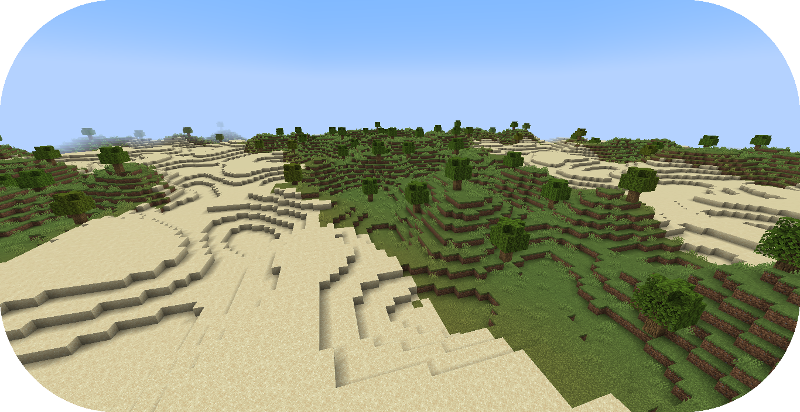

# 从零创建群系提供器

本教程将会讲述流水线式分布类型群系提供器的制作。

如果你还没有准备好，请在开始阅读前浏览“[配置开发介绍](../config-development-introduction.md)”章节。

更多创建新群系提供器的深入教程，请参阅这个非官方开发教程，[流水线式群系提供器](https://terra.atr.sh/#/page/pipeline%20biome%20provider)。

如果你遇到问题或需要示例，你可以在 [Github 仓库](https://github.com/PolyhedralDev/TerraPackFromScratch/)中找到本教程的参考用配置包。

## 设置新流水线

`步骤`

### 1. 添加流水线式群系提供器

[群系提供器](../../config-documentation/config-objects/biomeprovider.md)决定并配置生物群系在世界中的生成方式。

流水线式生物[群系提供器](../../config-documentation/config-objects/biomeprovider.md)适合将生物群系平面分布。

流水线操作先生成一个初始群系样式，随连续阶段改变到最终生成样式，如此决定生成群系的分布方式。

通过你[选择的编辑器](../config-development-introduction.md#选择编辑器)打开包验证文件。

将 `biome-provider-pipeline-v2` 作为依赖导入，使用版本为 `1.+`。

这个附属允许我们创建一个流水线式群系提供器。

``` YAML title="pack.yml" {6}
id: YOUR_PACK_ID
version: 0.6.0

addons:
  ...
  biome-provider-pipeline-v2: "1.+"
```

将如下所示的高亮部分加入配置，替代当前的 `SINGLE` 群系提供器，着手创建群系流水线。

``` YAML title="pack.yml" {5-7}
id: YOUR_PACK_ID

...

biomes:
  type: PIPELINE
  resolution: 4
```

`resolution` 决定了每个群系的 `像素`（即方块）大小。

提升 `resolution` 的值将会提升性能，但群系之间的过渡将会变得不自然。4 是介于性能与过渡之间的平衡数值。

### 2. 加入流水线混合器

群系流水线需要提供混合器，让群系与群系之间有自然的曲线边界，可以缓解上一个 `resolution` 参数导致的锯齿状边缘。

将高亮部分添加至配置，为群系流水线添加混合器。

配置中还利用了 `OPEN_SIMPLEX_2`。

``` YAML title="pack.yml" {8-12}
id: YOUR_PACK_ID

...

biomes:
  type: PIPELINE
  resolution: 4
  blend:
    amplitude: 2
    sampler:
      type: OPEN_SIMPLEX_2
      frequency: 0.1
```

`blend.amplitude` 决定了群系边界的弯曲程度。

`blend.sampler` 包含了[噪声取样器](../../config-documentation/config-objects/noisesampler.md)及其[参数](../the-config-system.md#参数)，能够模糊群系之间的边缘区域。

::: info

`OPEN_SIMPLEX_2` 与其他噪声取样器的相关文档可以在[这里](../../config-documentation/config-objects/noisesampler.md)找到。

:::

### 3. 添加流水线源

群系提供器需要一个用作初始群系样式的来源。

将高亮部分添加至配置，为群系流水线添加来源。

``` YAML title="pack.yml" {13-20}
id: YOUR_PACK_ID

...

biomes:
  type: PIPELINE
  resolution: 4
  blend:
    amplitude: 2
    sampler:
      type: OPEN_SIMPLEX_2
      frequency: 0.1
  pipeline:
    source:
      type: SAMPLER
      sampler:
        dimensions: 2
        type: CONSTANT
      biomes:
        - land: 1
```

`source.sampler` 通过[噪声采样器](../../config-documentation/config-objects/noisesampler.md)分布初始群系。我们将其的值设置为 `CONSTANT`，因为它就是个简单的流水线源。

`source_biomes` 是一个[流水线群系](../../config-documentation/config-objects/pipelinebiome.md)组成的[权重列表](../../config-documentation/config-objects/weightedlist.md)，作为初始样式。

在本示例中，我们会使用表示[流水线群系](../../config-documentation/config-objects/pipelinebiome.md)的临时变量，之后会通过[流水线阶段](../../config-documentation/config-objects/stage.md)替换为实际生物群系，否则地形包不会正常载入。

::: tip

最好将变量生物群系全部小写，便于在替换时将其与大写的生物群系分别开来。

:::

### 4. 添加流水线阶段

群系流水线需要一个阶段替换初始的变量群系。

如下高亮部分的配置可将 `REPLACE` 阶段加入群系流水线。

``` YAML title="pack.yml" {21-29}
id: YOUR_PACK_ID

...

biomes:
  type: PIPELINE
  resolution: 4
  blend:
    amplitude: 2
    sampler:
      type: OPEN_SIMPLEX_2
      frequency: 0.1
  pipeline:
    source:
      type: SAMPLER
      sampler:
        dimensions: 2
        type: CONSTANT
      biomes:
        - land: 1
    stages:
      - type: REPLACE
        sampler:
          type: OPEN_SIMPLEX_2
          frequency: 0.01
        from: land
        to:
          - FIRST_BIOME: 1
          - SECOND_BIOME: 1
```

`stages` 参数包含能够修改源样式的流水线阶段。

`REPLACE` 流水线阶段需要的[参数](../the-config-system.md#参数)为 `sampler`、`from` 和 `to`。

* `sampler` - 决定影响群系选择的[噪声取样器](../../config-documentation/config-objects/noisesampler.md)
* `from` - 指定会被替换的[标签](../../config-documentation/config-objects/tag.md)或群系。
* `to` - 指定替换 `from` 的[流水线群系](../../config-documentation/config-objects/pipelinebiome.md)的[权重列表](../../config-documentation/config-objects/weightedlist.md)。

权重列表的详细讲述可以在[这里](../noise/index.md)找到。

::::: info

除了 `FIRST_BIOME` 的群系都需要指定源，才能通过流水线进行分布生成。

如下所示为 [Github](https://github.com/PolyhedralDev/TerraPackFromScratch/tree/master/6-adding-pipeline) 上一个带有调色板的 `SECOND_BIOME` 示例。

:::: tabs

::: tab Second Biome

``` YAML title="secone_biome.yml"
id: SECOND_BIOME
type: BIOME
vanilla: minecraft:desert

terrain:
  sampler:
    type: EXPRESSION
    dimensions: 3
    expression: -y + 64

  sampler-2d:
    type: EXPRESSION
    dimensions: 2
    expression: (simplex(x, z)+1) * 2
    samplers:
      simplex:
        type: OPEN_SIMPLEX_2
        dimensions: 2
        frequency: 0.04

palette:
  - SAND_PALETTE: 319
```

::: 

::: tab 调色板

``` YAML title="sand_palette.yml"
id: SAND_PALETTE
type: PALETTE

layers:
  - materials: minecraft:sand
    layers: 3
  - materials: minecraft:sandstone
    layers: 2
  - materials: minecraft:stone
    layers: 1
```

:::

:::::

::: tip

你可以使用多个阶段来进一步分布群系。`SELF` 表示 `from` 中的群系。

``` YAML title="pack.yml" {17-20}
stages:
  - type: REPLACE
    sampler:
      type: OPEN_SIMPLEX_2
      frequency: 0.01
    from: land
    to:
      - FIRST_BIOME: 1
      - SECOND_BIOME: 1
      - THIRD_BIOME: 1

  - type: REPLACE
    sampler:
      type: OPEN_SIMPLEX_2
      frequency: 0.01
      salt: 3423
    from: FIRST_BIOME
    to:
      - SELF: 1
      - FOURTH_BIOME: 1
```

在上述的示例中，`land` 变量会在第一个 `REPLACE` 阶段中被替换为 `FISRT_BIOME`、`SCEOND_BIOME` 和 `THIRD_BIOME`。在接下来的 `REPLACE` 阶段中，`FIRST_BIOME` 又会被替换为 `SELF`（即 `FIRST_BIOME`）和 `FOURTH_BIOME`.

:::

### 5. 载入地形包

到了这一步，你的包就可以正常生成多个生物群系了！你可以通过开发客户端/服务器载入你刚刚编写的包。你可以通过 `/packs` 命令确认插件是否显示了（验证文件中指定的）包 ID，或者在服务器/客户端启动时从日志中确认。

如果你的包出于某种原因没有载入，控制台中会出现其无法载入的报错，请仔细解读并尝试自行排除问题所在，并重新尝试之前的步骤。

如果你还是没有办法载入地形包，随时欢迎带着相关报错[联系我们](../../../contact-and-support.md)。

::: info

`/pack reload` 命令不能在群系配置发生改动时使用，因为世界生成时会锁定注册的生物群系。

使用命令会导致出现 `试图执行命令时发生未知错误（An internal error occured while attemping to perform this command）` 提示。

客户端只需要重新创建一个世界，但服务器可能需要完全重启才可以让新生物群系载入。

:::

::: tip

Biome Tool 提供了可视化群系提供器的群系分布预览，更多信息可以在[这里](https://github.com/PolyhedralDev/BiomeTool)了解。

:::

## 总结

在你的包成功载入之后，你就可以生成带有多个群系的世界了！

本章节的参考配置可以在 Github 的[这个地方](https://github.com/PolyhedralDev/TerraPackFromScratch/tree/master/6-adding-pipeline)找到。

