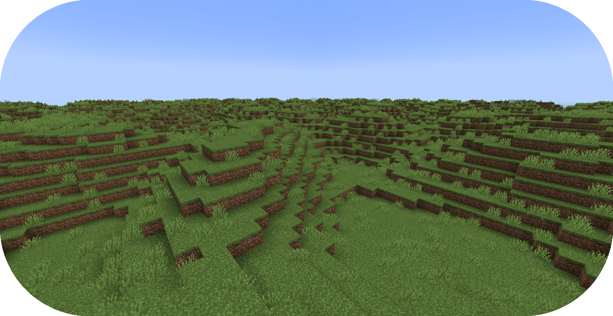

# 从零编写地物

本教程将会讲述地形包有关创建地物的步骤。

如果你还没有准备好，请在开始阅读前浏览“[配置开发介绍](../config-development-introduction.md)”章节。

更多创建地物的深入教程，请参阅这个非官方开发教程，[地物配置](https://terra.atr.sh/#/page/feature%20config)。

如果你遇到问题或需要示例，你可以在 [Github 仓库](https://github.com/PolyhedralDev/TerraPackFromScratch/)中找到本教程的参考用配置包。

## 设置新地物

`步骤`

### 1. 添加地物阶段

地物生成分为多个阶段。你的包需要至少设置一个阶段才可以生成地物。

通过你[选择的编辑器](../config-development-introduction.md#选择编辑器)打开包验证文件。

将 `generation-stage-feature` 作为依赖引入，版本为 `1.+`。

这个附属将会允许我们在包验证文件内创建新的生成阶段，借此生成地物。

``` YAML title="pack.yml" {6}
id: YOUR_PACK_ID
version: 0.4.0

addons:
  ...
  generation-stage-feature: "1.+"
```

将如下高亮内容加入你的包验证文件，创建生成阶段。

``` YAML title="pack.yml" {5-7}
id: YOUR_PACK_ID

...

stages:
  - id: flora
    type: FEATURE
```

::: warning

生成阶段 ID 可以自行填写，地物的生成会按配置中的顺序从上往下依次生成。

:::

### 2. 创建地物配置

将 `config-feature` 作为依赖引入，版本为 `1.+`。

这个附属允许我们创建地物配置文件。

``` YAML title="pack.yml" {6}
id: YOUR_PACK_ID
version: 0.4.0

addons:
  ...
  config-feature: "1.+"
```

[创建一个空配置文件](../config-files.md#创建配置文件)，名为 `grass_feature.yml`。

通过 `type` [参数](../the-config-system.md#参数)设置[配置类型](../the-config-system.md#配置类型)，并按如下所示填写 `id` 中的内容。

``` YAML title="grass_feature.yml"
id: GRASS_FEATURE
type: FEATURE
```

### 3. 设置地物分布

[分布器](../../config-documentation/config-objects/distributor.md)决定了地物在世界中的 X 与 Z 轴放置位置。

将 `config-feature` 作为依赖引入，版本为 `1.+`。

这个附属提供了一系列可在地物配置文件内使用的[分布器](../../config-documentation/config-objects/distributor.md)。

``` YAML title="pack.yml" {6}
id: YOUR_PACK_ID
version: 0.4.0

addons:
  ...
  config-distributors: "1.+"
```

配置 `grass_feature.yml` 文件，按如下所示将分布器类型设置为 `POSITIVE_WHITE_NOISE`。

``` YAML title="grass_feature.yml" {4-8}
id: GRASS_FEATURE
type: FEATURE

distributor:
  type: SAMPLER
  sampler:
    type: POSITIVE_WHITE_NOISE
  threshold: 0.25
```

::: info

分布器类型的相关文档可以在[这里](../../config-documentation/config-objects/distributor.md)找到。

`POSITIVE_WHITE_NOISE` 及其他噪声采样器的相关文档可以在[这里](../../config-documentation/config-objects/noisesampler.md)找到。

:::

### 4. 添加地物定位器

[定位器](../../config-documentation/config-objects/locator.md)决定了地物在世界上的 Y 轴位置。

将 `config-locators` 作为依赖引入，版本为 `1.+`。

这个附属提供了一系列可在地物配置文件内使用的[定位器](../../config-documentation/config-objects/locator.md)。

``` YAML title="pack.yml" {6}
id: YOUR_PACK_ID
version: 0.4.0

addons:
  ...
  config-locators: "1.+"
```

配置 `grass_feature.yml`，按如下配置添加 `SURFACE` 定位器。

``` YAML title="grass_feature.yml" {7-11}
id: GRASS_FEATURE
type: FEATURE

distributor:
  ...

locator:
  type: SURFACE
  range:
    min: 0
    max: 319
```

`SURFACE` 定位器类型会将地物放置在上方有空气接触的方块上。

每个定位器通常都需要定义一个检查范围 `range`。

`range` 有 `min`（最小值）与 `max`（最大值）两个[参数](../the-config-system.md#参数)。

::: info

其他几种定位器类型的相关文档可以在[这里](../../config-documentation/config-objects/locator.md)找到。

:::

### 5. 改进地物定位器

`SURFACE` 定位在方块顶端生成方块时非常实用，但它不会检查它放置的下方是什么方块。

通过使用 `AND` 定位器，我们可以使用多个[定位器](../../config-documentation/config-objects/locator.md)，使得地物生成的条件更加精确。

通过 `type` 为 `MATCH_SET` 的 `PATTERN` 定位器，我们可以指定地物生成时下方的方块满足的条件。

将如下高亮内容添加至配置，以实现额外的定位器。

``` YAML title="feature.yml" {8-21}
id: GRASS_FEATURE
type: FEATURE

distributor:
  ...

locator:
  type: AND
  locators:
    - type: SURFACE
      range: &range  # 用于其他定位器值的锚点
        min: 0
        max: 319
    - type: PATTERN
      range: *range  # 引用先前锚点的范围值
      pattern:
        type: MATCH_SET
        blocks:
          - minecraft:grass_block
          - minecraft:dirt
        offset: -1
```

`AND` 定位器列表中包含了 `SURFACE` 和 `PATTERN` 定位器，`SURFACE` 定义的范围通过锚点在 `PATTERN` 复用了一次。

`type` 为 `MATCH_SET` 的 `PATTERN` 定位器包含了两个[参数](../the-config-system.md#参数)，即 `blocks` 与 `offset`。

* `blocks` - 生成地物匹配的方块列表。
* `offset` - 检查方块的 Y 轴偏移量。

方块 `minecraft:grass_block` 和偏移量为 -1 的 `minecraft:dirt` 满足了生成地物下方的条件要求。

### 6. 添加结构

`structure-block-shortcut` 附属使得结构分布可以通过快捷方式放置，无需为了单个方块创建一整个结构文件。

将 `structure-block-shortcut` 作为依赖引入，版本为 `1.+`。

``` YAML title="pack.yml" {6}
id: YOUR_PACK_ID
version: 0.4.0

addons:
  ...
  structure-block-shortcut: "1.+"
```

现在，我们可以利用之前添加的 `structure-block-shortcut` 作为，将单个方块当做[结构](../../config-documentation/config-objects/structure.md)使用。

::: info

低于 1.20.3 的版本需要使用 `minecraft_grass`。

``` YAML title="grass_feature.yml" {10-13}
id: GRASS_FEATURE
type: FEATURE

distributor:
  ...

locator:
  ...

structures:
  distribution:
    type: CONSTANT
  structures: BLOCK:minecraft:short_grass
```

:::

`structures` 父键包含了两个[参数](../the-config-system.md#参数)，即 `structures.structures` 和 `structures.distribution`。

`structures.structures` 决定了生成在世界上的结构或结构[权重列表](../../config-documentation/config-objects/weightedlist.md)。

`structure.distribution` 影响了结构选择结果的[噪声采样器](../../config-documentation/config-objects/noisesampler.md)。

::: tip

在如下带有[噪声采样器](../../config-documentation/config-objects/noisesampler.md)的示例中，地物可以从地物或方块的[权重列表](../../config-documentation/config-objects/weightedlist.md)中选取，以引导结构选择，如下所示。

``` YAML title="feature.yml"
structures:
  distribution:
    type: WHITE_NOISE
    salt: 4357
  structures:
    - BLOCK:minecraft:poppy: 1
    - BLOCK:minecraft:blue_orchid: 1
    - BLOCK:minecraft:dandelion: 1
```

权重列表的详细介绍可以在[这里](../../config-documentation/config-objects/weightedlist.md)浏览。

:::

### 6. 将地物应用至群系

现在我们要将草地物添加至 `FIRST_BIOME`。

将高亮内容添加至 `FIRST_BIOME` 配置。

``` YAML title="first_biome.yml" {8-10}
id: FIRST_BIOME
type: BIOME

vanilla: minecraft:plains

...

features:
  flora:
    - GRASS_FEATURE
```

之后，`GRASS_FEATURE` 就会在 `FIRST_BIOME` 里生成草。

::: tip

群系配置的多生成阶段配置如下所示：

``` YAML title="first_biome.yml" {6-10}
id: FIRST_BIOME
type: BIOME

...

features:
  flora:
    - GRASS_FEATURE
  trees:
    - OAK_TREES
```

:::

### 7. 载入地形包

到了这一步，你的包就可以正常在世界中生成草了！你可以通过开发客户端/服务器载入你刚刚编写的包。你可以通过 `/packs` 命令确认插件是否显示了（验证文件中指定的）包 ID，或者在服务器/客户端启动时从日志中确认。

如果你的包出于某种原因没有载入，控制台中会出现其无法载入的报错，请仔细解读并尝试自行排除问题所在，并重新尝试之前的步骤。

如果你还是没有办法载入地形包，随时欢迎带着相关报错[联系我们](../../../contact-and-support.md)。

## 总结

在你的包成功载入之后，你就可以使用你的新地形包生成一片带着草的世界了！

本章节的参考配置可以在 Github 的[这个地方](https://github.com/PolyhedralDev/TerraPackFromScratch/tree/master/4-adding-grass)找到。

