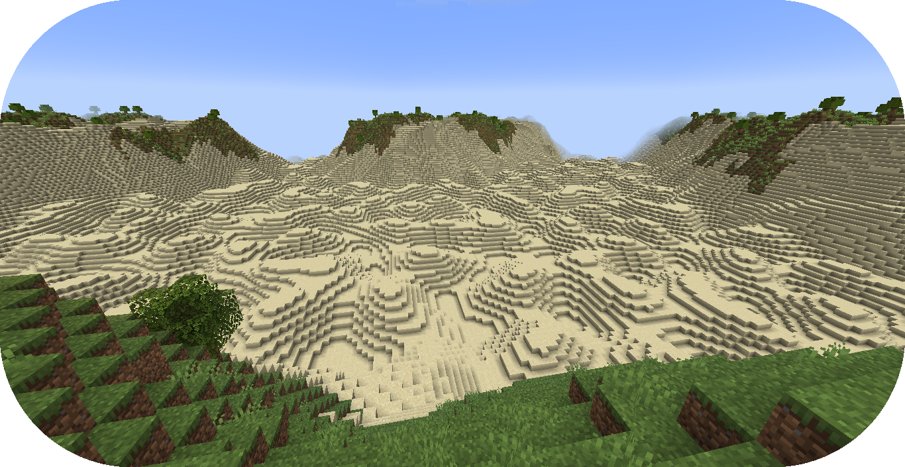
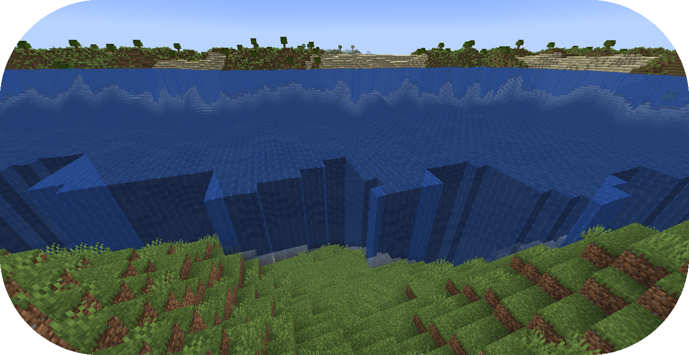
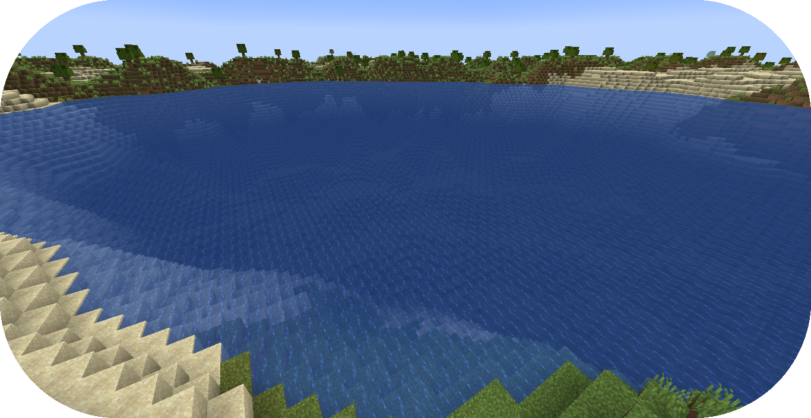

# 从零创建海洋

本教程将会讲述地形包有关创建调色板的步骤。

如果你还没有准备好，请在开始阅读前浏览“[配置开发介绍](../config-development-introduction.md)”和“[从零创建地形包](creating-a-pack-from-scratch.md)”章节。

如果你遇到问题或需要示例，你可以在 [Github 仓库](https://github.com/PolyhedralDev/TerraPackFromScratch/)中找到本教程的参考用配置包。

## 设置海洋

`步骤`

### 1. 添加海洋群系配置

生成海洋和相关地物少不了海洋群系的配置。

先[创建一个空白的配置文件](../config-files.md#创建配置文件)，名称为 `ocean_biome.yml`

通过 `type` [参数](../the-config-system.md#参数)设置[配置类型](../the-config-system.md#配置类型)，并按如下所示配置 `id`。

剩下 `OCEAN_BIOME` 的参数，按下文所示设置即可。

``` YAML title="ocean_biome.yml"
id: OCEAN_BIOME
type: BIOME

vanilla: minecraft:ocean

terrain:
  sampler:
    type: EXPRESSION
    dimensions: 3
    expression: -y + 32

  sampler-2d:
    type: EXPRESSION
    dimensions: 2
    expression: (simplex(x, z)+1) * 4
    samplers:
      simplex:
        type: OPEN_SIMPLEX_2
        dimensions: 2
        frequency: 0.04

palette:
  - SAND_PALETTE: 319
```

`OCEAN_BIOME` 现在会在较低的 Y 轴上生成地形，之后则会被水填满。

### 2. 将海洋群系添加至流水线

`OCEAN_BIOME` 要能在世界中分布，就需要将其添加至群系流水线中。

通过你[选择的编辑器](../config-development-introduction.md#选择编辑器)打开包验证文件。

将如下高亮内容加入配置，通过源噪声取样器在流水线中插入零散的海洋群系。

``` YAML title="pack.yml" {18-19,22,32-38}
id: YOUR_PACK_ID

...

biomes:
  type: PIPELINE
  resolution: 4
  blend:
    amplitude: 2
    sampler:
      type: OPEN_SIMPLEX_2
      frequency: 0.1
  pipeline:
    source:
      type: SAMPLER
      sampler:
        dimensions: 2
        type: OPEN_SIMPLEX_2
        frequency: 0.004
      biomes:
        - land: 1
        - ocean: 1
    stages:
      - type: REPLACE
        sampler:
          type: OPEN_SIMPLEX_2
          frequency: 0.01
        from: land
        to:
          - FIRST_BIOME: 1
          - SECOND_BIOME: 1
      - type: REPLACE
        sampler:
          type: OPEN_SIMPLEX_2
          frequency: 0.01
        from: ocean
        to:
          - OCEAN_BIOME: 1
```

如此，零散的 `ocean` 群系就会伴随着零散的 `land` 群系一起生成。

零散的 `ocean` 群系稍后会在 `REPLACE` 阶段被 `OCEAN_BIOME` 群系替换。

不要忘了为源[流水线群系](../../config-documentation/config-objects/pipelinebiome.md)替换 `CONSTANT` 采样器，不然世界上就只会生成 `OCEAN_BIOME` 了。

加入新的 `OCEAN_BIOME` 之后，即可看到干涸的海洋生成在了世界中。



### 3. 添加海洋调色板

海洋中必须充满水，这可以通过添加海洋调色板实现。

通过你[选择的编辑器](../config-development-introduction.md#选择编辑器)打开 `OCEAN_BIOME`。

将高亮内容添加进配置，为 `OCEAN_BIOME` 增加调色板。

``` YAML title="ocean_biome.yml" {11-13}
id: OCEAN_BIOME
type: BIOME

vanilla: minecraft:ocean

...

palette:
  - SAND_PALETTE: 319

ocean:
  palette: BLOCK:minecraft:water
  level: 62
```

`ocean.palette` 决定了替换空气的材料或方块。

`ocean.level` 决定了海洋调色板能填充的最大 Y 轴。

在本示例中，海洋调色板中的水方块将会填充 Y = 62 之下的任何空气。

::: warning

需要注意的是，`OCEAN_BIOME` 是唯一一个使用了这个调色板的群系配置，这会导致群系之间的边界有着相当明显的空气墙。

你可以将这个海洋调色板添加至所有群系，但实在过于繁杂，你需要将其添加至所有需要这个配置的群系，还需要更新它们。

:::



### 4. 添加抽象配置

为了让海洋群系的配置更加简便，我们需要用到抽象配置。

抽象配置可以避免在多个文件中重复配置[参数](../the-config-system.md#参数)，对于在群系间通用的几个[参数](../the-config-system.md#参数)非常有用。

[创建一个空白配置文件](../config-files.md#创建配置文件)，名为 `base.yml`。

通过 `type` [参数](../the-config-system.md#参数)设置[配置类型](../the-config-system.md#配置类型)，并按如下所示配置 `id`。

``` YAML title="base.yml"
id: BASE
type: BIOME
```

将如下内容加入配置，让配置变为抽象类型，并在其中配置海洋调色板。

``` YAML title="base.yml" {3,5-7}
id: BASE
type: BIOME
abstract: true

ocean:
  palette: BLOCK:minecraft:water
  level: 62
```

`abstract` [参数](../the-config-system.md#参数)设置为 `true` 后，`BASE` 不需要配置文件类型为 `BIOME` 时的一些[参数](../the-config-system.md#参数)。

在这个 `BASE` 配置里的所有[参数](../the-config-system.md#参数)可以应用至任意 `BIOME` 配置。

### 5. 导入抽象配置

为了让群系配置继承[参数](../the-config-system.md#参数)，首先我们需要引入 `BASE` 配置。

通过你[选择的编辑器](../config-development-introduction.md#选择编辑器)打开 `OCEAN_BIOME`。

移除海洋调色板相关配置，并将如下高亮内容加入，以引入 `BASE` 配置。

``` YAML title="ocean_biome.yml" {3}
id: OCEAN_BIOME
type: BIOME
extends: BASE

vanilla: minecraft:ocean

...

palette:
  - SAND_PALETTE: 319
```

因为 `BASE` 被列在了 `OCEAN_BIOME` 配置中 `extends` 的[参数](../the-config-system.md#参数)部分，`OCEAN_BIOME` 将会继承 `BASE` 中的[参数](../the-config-system.md#参数)。

每个群系配置都需要引入 `BASE` 才可以继承海洋调色板。

``` YAML title="first_biome.yml" {3}
id: FIRST_BIOME
type: BIOME
extends: BASE

...
```

``` YAML title="second_biome.yml" {3}
id: SECOND_BIOME
type: BIOME
extends: BASE

...
```

### 6. 载入地形包

到了这一步，你的包就可以正常生成海洋了。你可以通过开发客户端/服务器载入你刚刚编写的包。你可以通过 `/packs` 命令确认插件是否显示了（验证文件中指定的）包 ID，或者在服务器/客户端启动时从日志中确认。

如果你的包出于某种原因没有载入，控制台中会出现其无法载入的报错，请仔细解读并尝试自行排除问题所在，并重新尝试之前的步骤。

如果你还是没有办法载入地形包，随时欢迎带着相关报错[联系我们](../../../contact-and-support.md)。

## 总结

在你的包成功载入之后，你就可以生成带有海洋的世界了！

本章节的参考配置可以在 Github 的[这个地方](https://github.com/PolyhedralDev/TerraPackFromScratch/tree/master/7-adding-ocean)找到。


