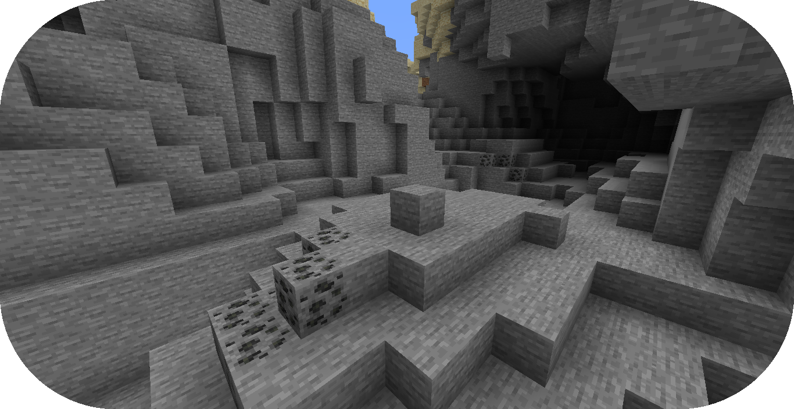

# 从零创建矿物

本教程将会讲述地形包有关创建矿物的步骤。

如果你还没有准备好，请在开始阅读前浏览“[配置开发介绍](../config-development-introduction.md)”与“[从零编写地形包](../creating-a-pack-from-scratch/creating-a-pack-from-scratch.md)”章节。

如果你遇到问题或需要示例，你可以在 [Github 仓库](https://github.com/PolyhedralDev/TerraPackFromScratch/)中找到本教程的参考用配置包。

## 设置矿物

`步骤`

### 1. 创建抽象矿物配置

矿物配置允许你配置矿物在世界中生成的方式。

通过你[选择的编辑器](../config-development-introduction.md#选择编辑器)打开包验证文件。

将 `config-ore` 作为依赖引入，版本为 `1.+`。

这个附属允许你创建矿物配置文件。

``` YAML title="pack.yml" {6}
id: YOUR_PACK_ID
version: 0.9.0

addons:
  ...
  config-ore: "1.+"
```

抽象矿物配置文件可以作为矿物配置的继承来源，且配置便捷。

[创建一个空白配置文件](../config-files.md#创建配置文件)，名为 `abstract_ore.yml`。

通过 `type` [参数](../the-config-system.md#参数)设置[配置类型](../the-config-system.md#配置类型)，并按如下示例配置 `id`：

``` YAML title="abstract_ore.yml"
id: ABSTRACT_ORE
type: ORE
abstract: true
```

将如下高亮部分的 `replace` 参数加入配置。

``` YAML title="abstract_ore.yml" {5-7}
id: ABSTRACT_ORE
type: ORE
abstract: true

replace:
  - minecraft:stone
  - minecraft:deepslate
```

`abstract` 参数设置为 true 时，允许其作为矿物配置而缺少必要参数。

`replace` 参数包含了一或多个方块名称，表示矿物配置替换的内容，本教程中为石头 `stone` 与深板岩 `deepslate`。

### 2. 创建矿物配置文件

准备好抽象矿物配置之后，矿物配置现在可以继承这些抽象参数了。

[创建一个空白配置文件](../config-files.md#创建配置文件)，名为 `coal_ore.yml`。

通过 `type` [参数](../the-config-system.md#参数)设置[配置类型](../the-config-system.md#配置类型)，并按如下示例配置 `id`：

``` YAML title="coal_ore.yml"
id: COAL_ORE
type: ORE
extends: ABSTRACT_ORE
```

将高亮部分的 `material`、`material-overrides` 和 `size` 加入配置。

``` YAML title="coal_ore.yml" {5-10}
id: COAL_ORE
type: ORE
extends: ABSTRACT_ORE

material: minecraft:coal_ore

material-overrides:
  minecraft:deepslate: minecraft:deepslate_coal_ore

size: 10
```

`COAL_ORE` 将会继承 `ABSTRACT_ORE` 才能替换石头与深板岩。

`material` 决定了矿物配置将会替换成的方块，这个例子中即为煤矿石。

`material-overrides` 决定了指定的方块被替换为煤矿石以后替换的方块。

在本示例中，深板岩方块会被替换为深层煤矿石，而非普通的煤矿石。

`size` 决定了生成的矿脉大小。

### 3. 添加矿物地物配置文件

在创建完矿物配置之后，在生成阶段将矿物作为地物置入就需要一个地物配置文件。

[创建一个空白配置文件](../config-files.md#创建配置文件)，名为 `coal_ore_feature.yml`。

通过 `type` [参数](../the-config-system.md#参数)设置[配置类型](../the-config-system.md#配置类型)，并按如下示例配置 `id`：

``` YAML title="coal_ore_feature.yml"
id: COAL_ORE_FEATURE
type: FEATURE
```

将高亮部分的[分布器](../../config-documentation/config-objects/distributor.md)、[定位器](../../config-documentation/config-objects/locator.md)与结构设置加入配置。

``` YAML title="coal_ore_feature.yml" {4-24}
id: COAL_ORE_FEATURE
type: FEATURE

distributor:
  type: SAMPLER
  sampler:
    type: POSITIVE_WHITE_NOISE
    salt: 1234
  threshold: 10 * (1/256)
# averageCountPerChunk 除以 16^2 以得到每列的 %

locator:
  type: GAUSSIAN_RANDOM
  amount: 1
  height:
    min: -64
    max: 192
  standard-deviation: (192-(-64))/6
# 将最小与最大距离除以 6，以拟合 3 个标准差

structures:
  distribution:
    type: CONSTANT
  structures: COAL_ORE
```

这个矿物的地物配置已经设置完毕，且已经调整到了最佳的生成方式。

[分布器](../../config-documentation/config-objects/distributor.md)上限是一个用于表示每区块矿物量的平均值，会除以 256。

[定位器](../../config-documentation/config-objects/locator.md) 通过带标准差的 `GAUSSIAN_RANDOM`，添加了最小与最大范围，会除以 6 以拟合 3 个范围内的标准差（约 99.7% 的结果）。因此，矿物生成密度在中间值附近趋于更高。

`structures.structures` 设置为使用先前创建的 `COAL_ORE` [矿物](../../config-documentation/config-files/ore.md)配置。

::: info

标准分布生成的矿物趋于均匀分布，而普通分布则会在中间值附近密度偏高。

标准矿物生成会使用如下的定位器。

``` YAML title="coal_ore_uniform.yml"
locator:
  type: RANDOM
  amount: 1
  height:
    min: -64
    max: 192
  salt: 1234
```

### 4. 添加矿物地物阶段

通过“[设置新地物](../creating-a-pack-from-scratch/creating-a-feature-from-scratch.md)”章节引入的 `generation-stage-feature` 附属，我们可以为矿物添加一个新生成阶段。

通过你[选择的编辑器](../config-development-introduction.md#选择编辑器)打开 `BASE` 配置文件。

将高亮部分的矿物生成阶段添加至配置中。

``` YAML title="pack.yml" {9-10}
id: YOUR_PACK_ID

...

stages:
  - id: preprocessors
    type: FEATURE

  - id: ores
    type: FEATURE

  - id: flora
    type: FEATURE

  - id: trees
    type: FEATURE
```

`ores` 生成阶段现在就可以将矿物作为地物，同时独立于其他地物生成。

### 5. 创建抽象矿物群系配置

除了将 `COAL_ORE` 逐个加入单独的群系配置，我们还可以选择继承抽象的群系配置，使得它们继承矿物地物生成。

这可以简化矿物和群系的开发流程，当增加的矿物和群系变多时，也无需逐个修改每个配置文件。

[创建一个空白配置文件](../config-files.md#创建配置文件)，名为 `ores_default.yml`。

通过 `type` [参数](../the-config-system.md#参数)设置[配置类型](../the-config-system.md#配置类型)，并按如下示例配置 `id`：

``` YAML title="ores_defaul.yml"
id: ORES_DEFAULT
type: BIOME
abstract: true
```

将高亮部分的 `ORES_DEFAULT` 矿物地物生成加入配置。

``` YAML title="ores_default.yml" {5-7}
id: ORES_DEFAULT
type: BIOME
abstract: true

features:
  ores:
    - COAL_ORE_FEATURE
```

`ORES_DEFAULT` 允许矿物生成阶段在一个文件中配置，可以被其他生成矿物的群系继承。

### 6. 继承抽象矿物群系配置

群系配置现在可以继承 `ORES_DEFAULT` 来继承和生成矿物地物。

除了单独为每个群系继承 `ORES_DEFAULT`，你还可以用已有的 `BASE` 抽象配置将其为每个群系继承。

这样，你可以通过 `BASE` 继承 `ORES_DEFAULT` 使得继承了 `BASE` 的群系同样继承矿物生成。

通过你[选择的编辑器](../config-development-introduction.md#选择编辑器)打开 `BASE` 配置文件。

将高亮部分的 `ORES_DEFAULT` 继承设置加入 `BASE` 配置中。

``` YAML title="base.yml" {4}
id: BASE
type: BIOME
abstract: true
extends: ORES_DEFAULT

ocean:
  palette: BLOCK:minecraft:water
  level: 62

features:
  preprocessors:
    - CONTAIN_FLOATING_WATER
```

`ORES_DEFAULT` 现在会继承到所有继承了 `BASE` 的群系配置中，并生成 `COAL_ORE_FEATURE`.

### 7. 载入地形包

到了这一步，你的包就可以正常生成矿物了！你可以通过开发客户端/服务器载入你刚刚编写的包。你可以通过 `/packs` 命令确认插件是否显示了（验证文件中指定的）包 ID，或者在服务器/客户端启动时从日志中确认。

如果你的包出于某种原因没有载入，控制台中会出现其无法载入的报错，请仔细解读并尝试自行排除问题所在，并重新尝试之前的步骤。

如果你还是没有办法载入地形包，随时欢迎带着相关报错[联系我们](../../../contact-and-support.md)。

## 总结

在你的包成功载入之后，你就可以生成带有矿物的世界了！

本章节的参考配置可以在 Github 的[这个地方](https://github.com/PolyhedralDev/TerraPackFromScratch/tree/master/9-adding-ores)找到。

