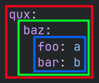

# 在配置中设置数据

在本章节，我们会讲述数据在配置内读写的基本方式。因为 Terra 配置支持多种语言，我们在章节中使用的术语可能会有所差异。

::: tip

如果你已经熟悉了数据结构及数据序列化语言，那么可以跳过并阅读下一部分。

:::

## 类型

**数据类型**是需要理解的主要概念之一。它能：

* 表示如何定义数据
* 数据应该包含什么
* 数据应该如何使用

正常情况下，数据类型一眼便知，但有时你还是需要告诉 Terra 使用哪种类型的数据。

配置中设置的一段数据称为“**对象**”。所有对象都可通过类型分类，而配置则可以决定其数据类型。配置文件总会先设定一个对象。

### 整数

若要使用这类数据，首先以 YAML 格式创建一个配置文件。在本示例中我们会用 `Integer`。

整数即没有小数部分的数，其写法如下所示：

:::: tabs

::: tab YAML
``` YAML [config.yml]
42
```
:::

::: tab JSON
``` JSON [config.json]
42
```
:::
::::

现在，我们就创建了一个定义了整数 `Integer` 的配置，其值为 `42`。

### 浮点数

与整数略有不同的即为浮点数（`Float`）。它与整数的区别在于它包含了小数：

:::: tabs

::: tab YAML

``` YAML [config.yml]
3.14159
```

:::

::: tab JSON

``` JSON [config.json]
3.14159
```

:::

::::

大多数情况下，我们需要区别整数与浮点数的区别，因为我们并不总是以小数标注一切数字，所以将这两种数分为两类还是有必要的。通常，需要整数的配置项不可以填入浮点数，但要求浮点数的配置项可以填入整数。

### 布尔值

布尔值（`Boolean`）表示数据只有两种状态。一般情况下这个数据用在那些“开关”状态的配置下，只能填入 *true* 或 *false*，如下所示：

:::: tabs

::: tab YAML

``` YAML [config.yml]
true
```

``` YAML [config.yml]
false
```

:::

::: tab JSON

``` JSON [config.json]
true
```

``` JSON [config.json]
false
```

:::

### 字符串

我们也可以将文本当做数据，即字符串（`String`）：

:::: tabs

::: tab YAML

``` YAML [config.yml]
这是一条字符串。
```

:::

::: tab JSON

``` JSON [config.json]
"这是一条字符串。"
```

:::

::::

字符串适合用来表示命名，且广泛运用——例如，在生物群系中指定需要生成的方块 ID。

在部分情况下你可能需要将字符串当做布尔值使用。若要强制将数据作为字符串，你可以使用引号将其包裹：

:::: tabs

::: tab YAML

``` YAML [config.yml]
"true"
```

:::

::: tab JSON

``` JSON [config.json]
"true"
```

:::

::::

### 映射表

单独的整数、浮点数以及字符串都没有太大的作用，直到我们将其组合并带上“标签”。这样的数据类型即映射表（`Map`）。

* 映射表是*一系列对象的集合*。
* 集合内的对象称作**值**。
* 另一个标注对象的“标签”即为**键**。

如下为映射表类型的配置，键与值的类型都是字符串：

:::: tabs

::: tab YAML

``` YAML [config.yml]
此为键: 此为值
```

::: tab JSON

``` JSON [config.json]
{
    "此为键": "此为值"
}
```

:::

::::

映射表是对象的集合，因此我们可以在其中填入多对键值，如下所示：

:::: tabs

::: tab YAML

``` YAML [config.yml]
字符串: 这里是文本
pi: 3.14159
万物的答案: 42
```

:::

::: tab JSON

``` JSON [config.json]
{
    "字符串": "这里是文本",
    "pi": 3.14159,
    "万物的答案": 42
}
```

:::

::::

就像上文所说，因为配置文本只能有一个主对象，因此这会非常实用。我们可以在映射表内填入多个对象，还能通过各自的标签快速找到它们。

每个在映射表里的键都不可以重复，因此如下的设置是无效的：

:::: tabs

::: tab YAML

``` YAML [config.yml]
重复键: 值甲
重复键: 值乙
```

:::

::: tab JSON

``` JSON [config.json]
{
    "重复键": "值甲",
    "重复键": "值乙"
}
```

:::

::::

#### 顺序

键值对的顺序并不重要，你可以在配置中任意排列它们。

如下的两段配置效果相同：

:::: tabs

::: tab YAML

``` YAML [config.yml]
a: 1234

b: 文本

c: true
```

``` YAML [config.yml]
b: 文本

c: true

a: 1234
```

::: 

::: tab JSON

``` JSON [config.json]
{
   "a": 1234,
   "b": "文本",
   "c": true
}
```

``` JSON [config.json]
{
   "b": "Some text",
   "c": true,
   "a": 1234
}
```

:::

::::

### 列表

除了地图自带，我们也可以通过列表（`List`）设定一个对象列表。与映射表不同的是，列表中的**元素**（列表中的对象）没有键，通过其位置区别。正因如此，*列表内元素的顺序会影响结果*。

如下为列表的示例配置，包含多个字符串：

:::: tabs

::: tab YAML

``` YAML [config.yml]
- 字符串
- 另一条字符串
- 最后的字符串
```

:::

::: tab JSON

``` JSON [config.json]
[
    "字符串",
    "另一条字符串",
    "最后的字符串"
]
```

:::

::::

## 联结对象

映射表与列表中的值可以是任意类型，因此可以将其任意组合。

::: tip

这样的嵌套式定义即为“联结”。

:::

:::: tabs

::: tab YAML

在设置映射表的值时，同行所在的内容即为其键。例如，浮点数 42 可以和它的键写在同一行，就像这样：

``` YAML
key: 42
```

会占据多行的数据类型，如映射表和列表难以塞在一行之内。例如，你可能需要将如下映射表嵌入其他映射表：

``` YAML
foo: a
bar: b
```

若要将映射表联结至其他映射表，例如 `baz`，可以按如下缩进方式进行设置：

``` YAML
baz:
  foo: a
  bar: b
```

缩进表示每行开头的空格数量。在 YAML 中，推荐两个空格为一个缩进，就像上文示例的那样。

列表也可以按相似的方式联结：

``` YAML
列表:
  - 元素甲
  - 元素乙
```

可以使用多级缩进，例如像这样，在 `qun` 之下（将其用作键对应的值）的复杂联结：

``` YAML
qux:
  baz:
    foo: a
    bar: b
```

每个映射表可以通过画方框的方式表示其关系：



:::

::: tab JSON

在映射表中嵌套映射表的示例：

``` JSON [config.json]
{
   "父键": {
      "子键": "值",
      "其他子键": "其他值"
   }
}
```

在映射表中嵌套列表的示例：

``` JSON [config.json]
{
    "我的列表": [
        "元素甲",
        "元素乙"
    ]
}
```

:::

::::

### 两值一键的错误定义方式

YAML 中有一个非常容易犯的错误，即为同一键分配两个不同的值。

如下所示的错误配置：

``` YAML
key: foo
  baz: bar
```

这里，为 `key` 分配了两个值，其一为 `foo`，其二为 `baz: bar` 的映射表。

将其中一个删除即可恢复正常：

``` YAML
key:
  bar: bar
```

或者

``` YAML
key: foo
```

配置可能在各种情况下出现类似的配置错误。

有些键会被删除或省略，可以将其加回去，如下所示：

``` YAML
key: foo
缺失的键:
  baz: bar
```

你可能会搞错某些值的缩进，如上的错误配置可以将其改为这样，从而恢复正常：

``` YAML
key: foo
baz: bar
```

## 组合

我们将这些不同的类型组合起来，用以表示复杂的数据结构，如下为一个购物清单和待办事项的示例，用到了我们上述讲过的大部分数据结构：

:::: tabs

::: tab YAML

``` YAML [config.yml]
shopping-list:
  - item: 一升牛奶
    amount: 2
    cost-per-item: 2.0
  - item: 一盒鸡蛋
    amount: 1
    cost-per-item: 4.5
appointments:
  - name: 理发
    date: 24.04.22
    start-time: 9:45
    end-time: 10:15
  - name: 看医生
    date: 13.05.22
    start-time: 3:15
    end-time: 4:15
```

::: 

::: tab JSON

``` JSON [config.json]
{
   "shopping-list": [
      {
         "item": "一升牛奶",
         "amount": 2,
         "cost-per-item": 2
      },
      {
         "item": "一盒鸡蛋",
         "amount": 1,
         "cost-per-item": 4.5
      }
   ],
   "appointments": [
      {
         "name": "理发",
         "date": "24.04.22",
         "start-time": 585,
         "end-time": 615
      },
      {
         "name": "看医生",
         "date": "13.05.22",
         "start-time": 195,
         "end-time": 255
      }
   ]
}
```

:::

::::

在这个例子中，配置文本的类型是映射表，包含了 `shopping-list` 和 `appointments` 两个键。它们的值是一个列表，其中的元素是映射表。

## 独有格式

部分数据序列化语言支持一些额外的格式，用于表达重复的值。在 YAML 中你可以通过花括号 `{}` 与方括号 `[]` 表示映射表与列表，通过英文逗号 `,` 分隔不同的元素。在需要将其表述为一行内容时非常有用：

``` YAML [config.yml]
curly-brace-map: {
  "key-1": "value-1",
  "key-2": "value-2"
}

square-bracket-list: [
  item-1,
  item-2,
  item-3
]

single-line-map: { "key-1": "value-1", "key-2": "value-2" }

single-line-list: [ item-1, item-2, item-3 ]

empty-map: {}

empty-list: []
```

### YAML 锚点

YAML 也提供了诸如**锚点**的额外功能，允许你在配置内复用其他数据，如果需要在配置中填入重复数据，这就是最好的选择。

``` YAML
数据列表: &锚点
  - 元素甲
  - 元素乙

复用数据处: *锚点
```

通过 YAML 语言拓展判断时，`复用数据处` 的值与 `数据列表` 相同。