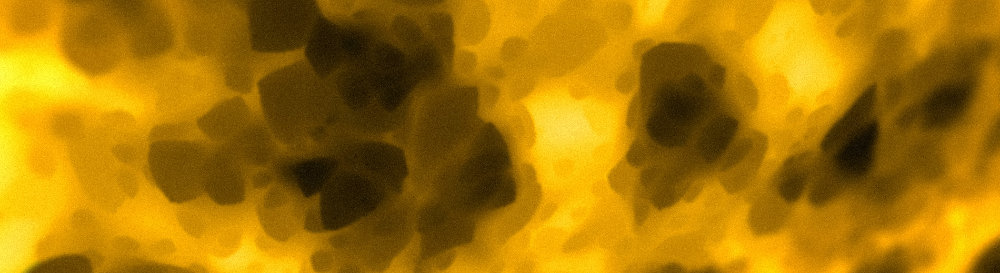
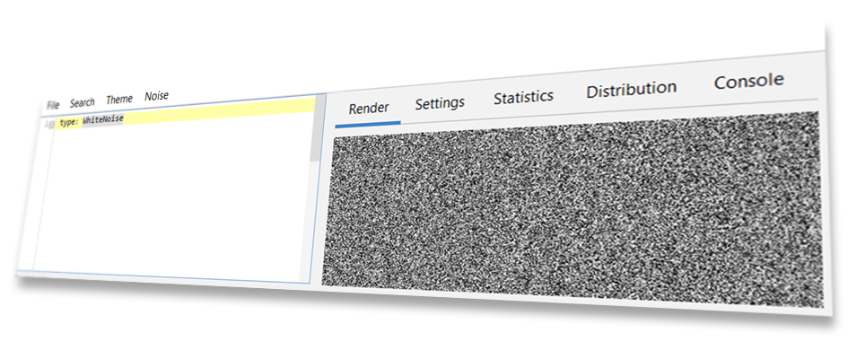
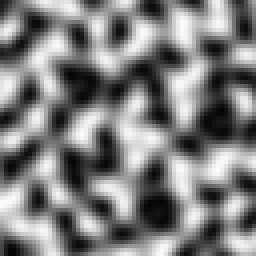
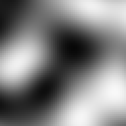
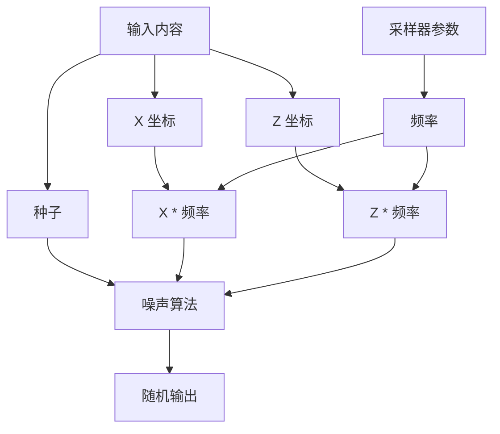
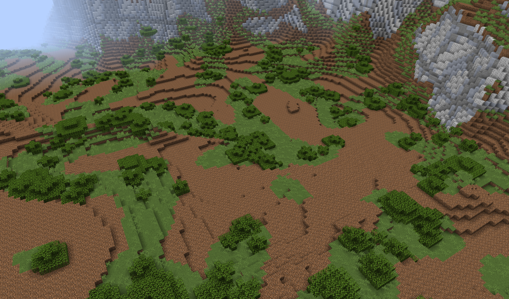
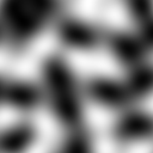
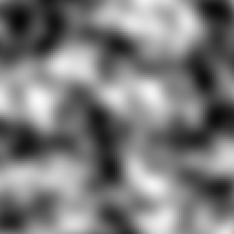
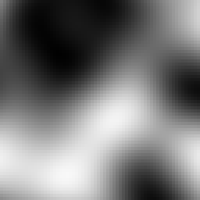
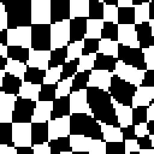

# 配置噪声采样器



在配置地形包时，有些参数会要求填入[噪声采样器](../../config-documentation/config-objects/noisesampler.md)。

最简单的这类配置只需要一个 `type` 参数，用于决定其使用的采样器类型。

白噪声采样器的类型为 `WHITE_NOISE`，可按如下方式使用：

``` YAML
type: WHITE_NOISE
```

在参数中使用时，如下所示：

``` YAML 
example-noise-sampler-parameter:
  type: WHITE_NOISE
```

## 参数

通过 `type` 参数使用的各种噪声采样器，可能会要求在配置中填入额外的*必选*或*可选*参数。

参数同样需要遵循配置文件的语法，而 `WHITE_NOISE` 一类的简单噪声采样器不需要填入额外参数。

### 常见的噪声采样器参数

#### 盐值

*可选*参数的一个例子就是 `WHITE_NOISE` 的 `salt`。盐值的功能在[这里](../../../terra-api/introduction-to-the-terra-api/registering-a-config-type.md)有详细讲述。

<!--注意：缺少具体章节名称-->

如下为 `salt` 参数的使用例子：

``` YAML
type: WHITE_NOISE
salt: 2321
```

所有可选的参数都有缺省值，在选择不填入时使用。同样，当采样器配置中没有 `salt` 时，则使用默认值 `0`。

### 噪声工具

知晓如何编写简单的噪声采样器配置后，我们就可以通过“**噪声工具**”可视化预览配置。



噪声工具是一款用于创建、预览和修改采样器的软件，本章节的所有噪声图像也由它生成。你可以在 Github（[源码](https://github.com/PolyhedralDev/NoiseTool)/[下载地址](https://github.com/PolyhedralDev/NoiseTool/releases)）找到它。

::: warning

噪声工具默认不会安装任何拓展。运行噪声工具时，程序所在的目录需要一个 `addons` 文件夹（若首次运行会自动创建）。你需要将 `Terra/addons` 下的 `bootstrap` 文件夹和 `config-noise-function` 复制到这个 `addon` 文件夹中。

:::

::: tip

我们假设你会一直遵守教程中的步骤，这样你就能了解参数的效果，使得自行编写时更得心应手。自己动手学习和测试有助于了解参数的用途，我们也会借此优势指导你如何调整它们。

:::

关于 Terra 中完整的采样器类型和参数，请见“[噪声采样器](../../config-documentation/config-objects/noisesampler.md)”章节。

#### 频率

**频率**决定了采样器输出的“比例”，值越高，输出的内容缩放越大，反之则越小。

下图为不同频率下简单函数生成的结果比较：

|2 倍频率|1 倍频率|0.5 倍频率|
|:---:|:---:|:---:|
||||

通常来讲：

**频率越高**

* 显示比例*越小*；
* 模拟图像更*精细、丰富*；
* 单位空间里的“点”更多。

**频率越低**

* 显示比例*越大*；
* 模拟图像更*简单、粗略*；
* 单位空间里的“点”更少。

可以通过 `frequency` 参数为[支持它的噪声采样器](../../config-documentation/config-objects/noisesampler.md)设置频率：

``` YAML 
type: <采样器类型>
frequency: <所选频率>
```

::: info

一般情况下，调整频率只对“相干噪声”分类中的采样器有效。虽然你可以修改那些依赖随机噪声的采样器频率，但它们没有像相干噪声那样控制比例的属性。改变随机噪声采样器的频率与修改种子无异，因此没有多大理由修改它们。

:::

::: details 表面之下 - 频率的原理

频率背后的数学原理非常简单：*将输入采样器的坐标轴乘以频率值本身*。如下为处理过程的数学模型：



例如，当我们将频率设置为 **2** 时进行坐标采样 **（X = 3，Z = 2）**，首先坐标将被乘以频率 **2**，得到缩放后坐标 **（X' = 6，Z' = 4）**。它们会被放入采样器，最终输出结果。

基于这个逻辑，如下的给定参数：

**（X = 3，Z = 2，频率 = 2）**

与下面给定参数的输出结果相同：

**（X = 6，Z = 4，频率 = 1）**

更高的频率随输入坐标的提升而有*更快的改变*，这也是可视化图中细节更相近且更小的原因。

这个概念在几何学中被称为[缩放](https://zh.wikipedia.org/wiki/%E7%BC%A9%E6%94%BE)，可以视为在放入采样器前缩放世界的坐标轴。

:::

### 采样器情境应用

为了更好了解地形包中采样器的工作方式，下文以调色板配置为例展示了采样器的配置。对应部分已高亮标出：

``` YAML {9-10}
id: DIRTY_GRASS
layers:
  - # 单层草与泥土方块
    layers: 1
    materials:
      - "minecraft:grass_block": 1
      - "minecraft:coarse_dirt": 1
    sampler:
      type: OPEN_SIMPLEX_2
      frequency: 0.05
  - # 顶层之下的两层泥土
    layers: 2
    materials: "minecraft:dirt"
  - # 最后是石头
    layers: 1
    materials: "minecraft:stone"
```

这段配置中的噪声决定了[权重列表](../../config-documentation/config-objects/weightedlist.md)中材料的生成规律。为了更好理解它们之间的关系，如下的图片展示了使用这种调色板配置生成的世界：



## 其他噪声采样器方法

### 分形化

在某些情况下，[相干噪声](how-noise-samplers-work.md)太过平滑、重复，难以生成更加“真实”的地形。看看上述的图片，你可能注意到只有简单噪声的地形像*浸满雨滴的窗户*，这对我们添加更多细节不利。这时，我们就要用上**分形化**了。

分形化的方法，就是将多层同种噪声函数叠加，每一层（称之为倍频程）的[频率](#频率)更高，强度更低（对最终输出的影响更小）。创建[分形](https://zh.wikipedia.org/wiki/%E5%88%86%E5%BD%A2)的过程即为[分形布朗运动](https://en.wikipedia.org/wiki/Fractional_Brownian_motion)（通常称为 fBm）

|无分形|2倍频程|3倍频程|4倍频程|
|:---:|:---:|:---:|:---:|
|||||

如你所见，倍频程越多，噪声细节越丰富。添加细节，尤其对于超低频噪声来说，是分形化应用的主要场景。

配置分形化采样器时，我们会将其定义为*自有采样器配置*，它要求填入*目标采样器配置*作为参数。格式如下所示：

``` YAML 
type: <分形类型>
sampler:
  type: ... # 需要分形化的采样器配置
```

如你所见，我们为分形设置了主采样器，第二个采样器配置则*联结*填入 `sampler` 下。`sampler` 是所有分形器**唯一的**必填参数。

如下为 `FBM` 分形的示例配置，输入采样器为 `OPEN_SIMPLEX_2`：

``` YAML
type: FBM
sampler:
  type: OPEN_SIMPLEX_2
```

非常简单，我们只需将*简单噪声*放入*FBM*采样器中。分形器有一对额外的参数，包括 `octaves`、`lacunarity` 以及 `gain`。如下为设置了这些参数的示例配置：

``` YAML
type: FBM
sampler:
  type: OPEN_SIMPLEX_2
octaves: 3
lacunarity: 2
gain: 0.75
```

你可以在[噪声工具](#噪声工具)中预览这些配置，并通过调整参数观察它们的用处。

所有分形器和参数请参阅“[噪声采样器](../../config-documentation/config-objects/noisesampler.md)”章节。

## 域扭曲

与[分形](#分形化)相似，域扭曲需要一个采样器，再以某种形式修改它。更准确来讲，域扭曲允许你用“另一个扭曲采样器”扭曲采样器的输出。

为了更直观地了解这段话，我们拿出一个 64x64 的采样图案。待扭曲的采样为左边的棋盘状图案，参与扭曲的采样为右边的简单噪声。

|待扭曲的采样|参与扭曲的采样|
|:---:|:---:|
|||

经过域扭曲处理的结果如下所示：



如你所见，整齐的方格被扭曲采样器变成了不规则形状。

若要使用域扭曲，我们需要将 `type` 设置为 `DOMAIN_WARP`，并设置两个额外参数 `sampler` 和 `warp`。你可能已经猜到了，`sampler` 和 `warp` 都需要填入采样器配置，与分形器接受的采样器大致相似。

``` YAML
type: DOMAIN_WARP
sampler:
  type: ... # 待扭曲的噪声配置
warp:
  type: ... # 参与扭曲的噪声配置
```

另外，我们可以指定 `amplitude`，它表示扭曲效果的强度。如下为真实采样器的示例，其中通过另一个简单采样器对低频率简单噪声进行了扭曲：

``` YAML
type: DOMAIN_WARP
sampler:
  type: OPEN_SIMPLEX_2
  frequency: 0.005
warp:
  type: OPEN_SIMPLEX_2
amplitude: 20
```

同样，这些配置你也可以放入[噪声工具](#噪声工具)并通过修改参数了解各自的详细作用 - 如果你把参与扭曲的采样器改为 `WHITE_NOISE` 会发生什么？

::: details 表面之下 - 域扭曲的数学原理

为了深入了解这里的现象，让我们解释一下用于域扭曲的公式：

* 假设 `sampler(coordinates)` 是待扭曲的采样器，`coordinate` 表示输入值（例如与之前相似的 X 和 Z 坐标）。
* 为了*变换*`sampler`，我们只需向输入施加变换：`sampler(coordinates + translation)`。变换意味着简单的上下左右移动。
* 假设 `warp_sampler(coordinate)` 为扭曲采样器。
* 如果我们对 `warp_sampler` 施加 `translation`，那么 `sampler` 的 `coodrinate` 将会被 `warp_sampler` 变换，即：

`sampler(coordinate + warp_sampler(coodrinate))`

* 最后，我们将 `amplitude` 乘以 `warp_sampler` 的输出值，这个参数决定了扭曲的“强度”，以此我们得到最终公式：

`sampler(coordinate + warp_sampler(coordinate) * amplitude)`

需要注意的是，每个坐标的域通常有多个 `warp_sampler`，各自的盐值不同。如果没有这些，每个坐标都会以同一盐值进行扭曲，这会导致轴变换相同，最终导致各向异性。

:::

## 采样配置

鉴于诸如 `sampler` 和 `warp` 的键填入的内容为采样器配置，我们可以将[域扭曲](#域扭曲)嵌套填入。实际上，因为采样器接受**任意**采样器配置当作参数，所以所有采样器都可以这么做。它向我们展示了配置高度复杂采样器系统的可能性，因此潜力无穷。如下为用更多分形简单噪声（同样被分形噪声扭曲过）扭曲了[分形](#分形化)简单噪声的示例配置：

``` YAML
type: DOMAIN_WARP
amplitude: 300

sampler:
  type: FBM
  sampler:
    type: OPEN_SIMPLEX_2
    frequency: 0.002

warp:
  type: DOMAIN_WARP
  amplitude: 20

  sampler:
    type: FBM
    sampler:
      type: OPEN_SIMPLEX_2
      frequency: 0.003

  warp:
    type: FBM
    sampler:
      type: OPEN_SIMPLEX_2
      frequency: 0.02
```