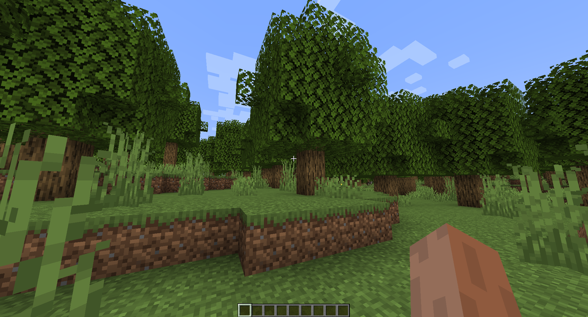

# 添加结构

在本章节教程中，我们会创建并注册可以生成在世界中的结构。

## 结构

structure 接口表示可以生成在世界中的*结构*；即一系列生成在指定位置的方块。部分可能出现结构的示例有：

* 植被
* 花卉
* 树木
* 岩石

结构通常在世界生成后进一步装饰地形。

## 创建结构

若要创建结构，只需新建类并集成[结构](../../config-packs/config-documentation/config-objects/structure.md)接口。在本教程中，我们将结构命名为 `com.example.addon.structure.ExampleStructure`，你可以自定义它的名称！

``` Java
package com.example.addon.structure;

import com.dfsek.terra.api.structure.Structure;
import com.dfsek.terra.api.util.Rotation;
import com.dfsek.terra.api.util.vector.Vector3Int;
import com.dfsek.terra.api.world.WritableWorld;

import java.util.Random;

public class ExampleStructure implements Structure {
    @Override
    public boolean generate(Vector3Int location, WritableWorld world, Random random, Rotation rotation) {
        return false;
    }
}
```

## 生成结构

现在，我们的 `Structure` 实现不会生成任何东西。若要在世界中生成结构，我们需要多次使用[可读取世界](https://ci.codemc.io/job/PolyhedralDev/job/Terra/javadoc/com/dfsek/terra/api/world/WritableWorld.html)的 `#setBlockState` 方法。让我们先试着生成树吧！

### 获取方块状态

首先，我们需要获取生成的 [BlockState](https://ci.codemc.io/job/PolyhedralDev/job/Terra/javadoc/com/dfsek/terra/api/block/state/BlockState.html)。在此之前，我们需要通过 [Platform](https://ci.codemc.io/job/PolyhedralDev/job/Terra/javadoc/com/dfsek/terra/api/Platform.html) 实例获取 [WorldHandle](https://ci.codemc.io/job/PolyhedralDev/job/Terra/javadoc/com/dfsek/terra/api/handle/WorldHandle.html)。让我们先将 `Platform` 传入 `Structure` 的构造器，并使用 [WorldHandle#createBlockState(String)](https://ci.codemc.io/job/PolyhedralDev/job/Terra/javadoc/com/dfsek/terra/api/handle/WorldHandle.html#createBlockState-java.lang.String-) 创建方块状态！

``` Java
public class ExampleStructure implements Structure {
    private final Platform platform;

    public ExampleStructure(Platform platform) {
        this.platform = platform;
    }

    @Override
    public boolean generate(Vector3Int location, WritableWorld world, Random random, Rotation rotation) {
        BlockState oakLog = platform.getWorldHandle().createBlockState("minecraft:oak_log[axis=y]");
        BlockState oakLeaves = platform.getWorldHandle().createBlockState("minecraft:oak_leaves[persistent=true]");

        return false;
    }
}
```

::: info

如果你习惯使用 Bukkit API，Terra 的 [BlockState](https://ci.codemc.io/job/PolyhedralDev/job/Terra/javadoc/com/dfsek/terra/api/block/state/BlockState.html) 与 Bukkit 的 `BlockData` 大致相似。我们将其称作方块状态（Block State）的原因是它更接近对象的含义，另外 Minecraft 内部也使用这个名称。

:::

::: warning

如果你在附属中实现了结构，你就需要*在*初始化*时*就获取方块状态，然后再在结构的 `#generate` 方法中使用现存的实例。为了让教程更加简单，我们选择在 `#generate` 方法中获取它们。

通常建议让方块状态可配置，这样可以让你的附属有更强的跨平台兼容性，但如果你需要硬编码方块状态，你可以：

* 直接在结构构造器中初始化它们；
* 在入口处初始化，并将其传入结构；
* 使用 [Lazy](https://ci.codemc.io/job/PolyhedralDev/job/Terra/javadoc/com/dfsek/terra/api/util/generic/Lazy.html) 工具类实现懒载入。

:::

### 生成方块

有了方块状态之后，我们就可以将结构放置在世界中了！为了这么做，我们需要使用 [WritableWorld](https://ci.codemc.io/job/PolyhedralDev/job/Terra/javadoc/com/dfsek/terra/api/world/WritableWorld.html) 的 `#setBlockState` 方法。生成树木时，我们先生成树叶，再向其中插入树干：

``` Java
public class ExampleStructure implements Structure {
    private final Platform platform;

    public ExampleStructure(Platform platform) {
        this.platform = platform;
    }

    @Override
    public boolean generate(Vector3Int location, WritableWorld world, Random random, Rotation rotation) {
        BlockState oakLog = platform.getWorldHandle().createBlockState("minecraft:oak_log[axis=y]");
        BlockState oakLeaves = platform.getWorldHandle().createBlockState("minecraft:oak_leaves[persistent=true]");

        int height = random.nextInt(5, 8);                               // 树干高度将会限制在 [5, 8) 的范围。

        GeometryUtil.sphere(
                Vector3Int.of(location, 0, height, 0),                   // 在树木顶端生成树叶
                3,                                                       // 树叶范围为 3 格球体半径
                leafLocation -> {                                        // 消耗者会在每次球体范围预测后调用。
                    world.setBlockState(leafLocation, oakLeaves);
                }
        );

        for (int y = 0; y < height; y++) {                               // 遍历高度。
            Vector3Int trunkLocation = Vector3Int.of(location, 0, y, 0); // 先在这里生成一部分树干。
            world.setBlockState(trunkLocation, oakLog);                  // 在指定位置生成树干。
        }

        return true;                                                     // 结构正确生成。
    }
}
```

::: info

如果你习惯使用 Bukkit API，你可能想在 Terra 中找到类似 `Location` 类的东西，这实际上是一种 `World` 与 `Vector3` 的结合。Terra API 没有这样的类。将世界从位置中分离可以简化多世界类型的集成。

Terra API 同样缺少 Bukkit 中的 `Block` 对应类，理由同上。Bukkit 的 `Block` 实际上是一种 `World`、`Vector3Int` *与* `BlockState` 的杂糅。

:::

## 注册结构

完成结构后，再次编译安装拓展，你还是...看不到变化。这是因为我们还没有*注册*我们的结构。如果我们没有注册结构，Terra 就无从知晓它的存在。

### Keyed 实现

虽然通过 [RegistryKey](https://ci.codemc.io/job/PolyhedralDev/job/Terra/javadoc/com/dfsek/terra/api/registry/key/RegistryKey.html) 实例注册完全可行，但是通过 [Keyed](https://ci.codemc.io/job/PolyhedralDev/job/Terra/javadoc/com/dfsek/terra/api/registry/key/Keyed.html) 接口注册你想要的对象显得更为明了。注册同类型的多个对象时更加明显。实现 keyed 的代码基本上就是 `class Thing implements Keyed<Thing>`。

如果你曾接触过 [Comparable](https://docs.oracle.com/en/java/javase/21/docs/api/java.base/java/lang/Comparable.html)，它的思路与其相似；`Keyed` 的参数类型一般与实现它的类相同。

先在我们的示例实例内实现 `Keyed`。

``` Java
public class ExampleStructure implements Structure, Keyed<ExampleStructure> {
    private final Platform platform;
    private final RegistryKey key;

    public ExampleStructure(Platform platform, RegistryKey key) {
        this.platform = platform;
        this.key = key;
    }

    @Override
    public boolean generate(Vector3Int location, WritableWorld world, Random random, Rotation rotation) {
        // ... 生成逻辑
    }

    @Override
    public RegistryKey getRegistryKey() {
        return key;
    }
}
```

当某个对象实现了 `Keyed`，它必须提供一个 [RegistryKey](https://ci.codemc.io/job/PolyhedralDev/job/Terra/javadoc/com/dfsek/terra/api/registry/key/RegistryKey.html)，以此表示它的键 ID。我们通过构造器中设置的字段即可获取它的实例。

### 创建键

在拥有了一个 `Keyed` 结构之后，让我们注册它！返回我们的入口，让我们重新访问 [ConfigPackPreLoad](https://ci.codemc.io/job/PolyhedralDev/job/Terra/javadoc/com/dfsek/terra/api/event/events/config/pack/ConfigPackPreLoadEvent.html) 监听器。

首先，创建一个待注册的实例。我们的结构需要 [Platform](https://ci.codemc.io/job/PolyhedralDev/job/Terra/javadoc/com/dfsek/terra/api/Platform.html) 实例，以及一个不重复的 [RegistryKey](https://ci.codemc.io/job/PolyhedralDev/job/Terra/javadoc/com/dfsek/terra/api/registry/key/RegistryKey.html) 实例。

* 我们有从依赖注入中获得的 `Platform` 实例。
* 我们可以从任何实现了 [Namepspaced](https://ci.codemc.io/job/PolyhedralDev/job/Terra/javadoc/com/dfsek/terra/api/registry/key/Namespaced.html) 的对象中创建 [RegistryKey](https://ci.codemc.io/job/PolyhedralDev/job/Terra/javadoc/com/dfsek/terra/api/registry/key/RegistryKey.html) 实例。在本示例中，我们需要使用附属的命名空间，因此选择 [BaseAddon](https://ci.codemc.io/job/PolyhedralDev/job/Terra/javadoc/com/dfsek/terra/api/addon/BaseAddon.html) 实例（先前也已注入）创建键：

``` Java
RegistryKey key = addon.key("EXAMPLE_STRUCTURE"); // 创建注册键
```

现在，我们拥有了实例化结构的对象，可以着手创建实例：

``` Java
public class ExampleEntryPoint implements AddonInitializer {
    @Inject
    private Logger logger;

    @Inject
    private Platform platform;

    @Inject
    private BaseAddon addon;

    @Override
    public void initialize() {
        logger.info("你好，世界！");

        RegistryKey key = addon.key("EXAMPLE_STRUCTURE");

        ExampleStructure theStructure = new ExampleStructure(platform, key);

        platform.getEventManager()
                .getHandler(FunctionalEventHandler.class)
                .register(addon, ConfigPackPreLoadEvent.class)
                .then(event -> {
                    logger.info("正在尝试载入配置包！");
                });
    }
}
```

### 注册实例

有了实例之后，我们终于可以注册它了！但你再次志气啊，我们还需要注册条目。我们可以通过 [ConfigPackPreLoadEvent](https://ci.codemc.io/job/PolyhedralDev/job/Terra/javadoc/com/dfsek/terra/api/event/events/config/pack/ConfigPackPreLoadEvent.html) 提供的 [ConfigPack](https://ci.codemc.io/job/PolyhedralDev/job/Terra/javadoc/com/dfsek/terra/api/config/ConfigPack.html) 获取它。

``` Java
platform.getEventManager()
        .getHandler(FunctionalEventHandler.class)
        .register(addon, ConfigPackPreLoadEvent.class)
        .then(event -> {
            logger.info("正在尝试载入配置包！");

            ConfigPack pack = event.getPack();
        });
```

可以通过 `#getCreateRegistry` 获取注册条目。我们需要的是结构条目，所以这样写：

``` Java
platform.getEventManager()
        .getHandler(FunctionalEventHandler.class)
        .register(addon, ConfigPackPreLoadEvent.class)
        .then(event -> {
            logger.info("正在尝试载入配置包！");

            ConfigPack pack = event.getPack();
            CheckedRegistry<Structure> structureRegistry = pack.getOrCreateRegistry(Structure.class);
        });
```

现在我们有了结构注册条目，终于可以通过 `#register` 注册结构实例了！

``` Java
platform.getEventManager()
        .getHandler(FunctionalEventHandler.class)
        .register(addon, ConfigPackPreLoadEvent.class)
        .then(event -> {
            logger.info("正在尝试载入配置包！");

            ConfigPack pack = event.getPack();
            CheckedRegistry<Structure> structureRegistry = pack.getOrCreateRegistry(Structure.class);
            structureRegistry.register(theStructure);
        });
```

## 将结构纳入世界生成

注册了结构以后，它就可以用在世界生成中。来试试看把它加入配置包中吧！

### 创建地物

通过这个配置创建一个能生成这个结构的*地物*：

``` YAML
id: EXAMPLE_FEATURE
type: FEATURE

distributor:
  type: SAMPLER
  sampler:
    type: POSITIVE_WHITE_NOISE
  threshold: 0.03

locator:
  type: PATTERN
  range:
    min: 64
    max: 150
  pattern:
    type: AND
    patterns:
      - type: MATCH_AIR
        offset: 1
      - type: MATCH
        block: "minecraft:grass_block"
        offset: 0

structures:
  distribution:
    type: CELLULAR
    return: CellValue
    frequency: 0.03
  structures: EXAMPLE_STRUCTURE # 你的结构！
```

::: warning

这个配置需要 `generation-stage-feature`、`config-feature`、`config-locators` 以及 `config-distributors` 核心附属才可生效！这些都是核心附属，Terra 默认包含，但如果你正在自制地形包，则你需要手动设置依赖它们！

:::

### 将地物纳入群系

现在，只需添加一个 `feature` 键即可将你的新地物加入群系！如下为将其加入默认包 `PLAINS` 群系的示例配置：

``` YAML
id: PLAINS
type: BIOME
extends: [ EQ_PLAIN, CARVING_LAND, BASE ]
vanilla: minecraft:plains
color: $biomes/colors.yml:PLAINS

tags:
  - USE_RIVER

colors:
  grass: 0x91bd59
  foliage: 0x77ab2f
  water: 0x44aff5
  water-fog: 0x44aff5

palette:
  - GRASS: 255
  - << meta.yml:palette-bottom

features:
  flora:
    - GRASS
    - FLOWER_PATCHES
  trees:
    - SPARSE_OAK_TREES
    - EXAMPLE_FEATURE # 我们的地物！
```

## 总结

现在，启动 Terra 并生成世界，你就可以在配置的群系中看到你的结构了！

