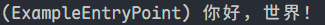

# 创建简单附属

搭建项目完毕后，你可以着手编写第一个拓展了！本章节将会讲述如何通过 Terra 利用验证拓展加载器创建一个简单的“你好，世界！”。

## 创建附属验证文件

首先，你需要创建附属验证文件。它包含了验证附属加载器所需读取的数据。验证文件应当位于 jar 文件的根目录，名称为 `terra.addon.yml`。

``` YAML
schema-version: 1
contributors:
  - Terra Contributors
id: example-addon
version: 0.1.0
entrypoints:
  - "com.example.addon.ExampleEntryPoint"
license: MIT License
```

::: info

验证文件应当位于项目的*资源目录*中（通常为 `src/main/resources`）。

:::

对于你的第一个附属，你可以直接复制粘贴这个验证文件，并按需要修改。在修改任何内容之前，请先在[这里](../api-concepts/manifest-addons.md)了解它们的作用。

## 创建入口

入口是验证加载器初始化附属的位置。在项目中新建一个 Java 类，名称为验证文件中 `entrypoints` 对应的内容。如果你没有修改过验证文件，则它为 `com.example.addon.ExampleEntryPoint`。在你新建的类中，先实现 `AddonInitializer`：

``` Java
package com.example.addon;

import com.dfsek.terra.addons.manifest.api.AddonInitializer;

public class ExampleEntryPoint implements AddonInitializer {
    @Override
    public void initialize() {

    }
}
```

## 向附属添加功能

现在，你拥有了一个 Terra 可识别并载入的拓展！但它现在没有任何功能。这是因为你的入口是空的，接下来就让我们向它添加一些功能吧！

### 注入记录器

让我们为附属添加一条启动时提醒。首先我们需要一个[记录器](https://www.slf4j.org/apidocs/org/slf4j/Logger.html)。这里有两种方法访问它，这里选择使用[依赖注入](../api-concepts/dependency-injection.md)方法实现：

``` Java
package com.example.addon;

import com.dfsek.terra.addons.manifest.api.AddonInitializer;
import com.dfsek.terra.api.inject.annotations.Inject;
import org.slf4j.Logger;

public class ExampleEntryPoint implements AddonInitializer {
    @Inject
    private Logger logger;

    @Override
    public void initialize() {

    }
}
```

`logger` 字段现在是[记录器](https://www.slf4j.org/apidocs/org/slf4j/Logger.html)的注入目标。这表示在我们的附属初始化之前，它就会获得一个记录器对象。

### 使用记录器

有了记录器，但我们的附属还是没有任何功能。我们可以着手添加一个插件初始化信息！

``` Java
package com.example.addon;

import com.dfsek.terra.addons.manifest.api.AddonInitializer;
import com.dfsek.terra.api.inject.annotations.Inject;
import org.slf4j.Logger;

public class ExampleEntryPoint implements AddonInitializer {
    @Inject
    private Logger logger;

    @Override
    public void initialize() {
        logger.info("你好，世界！");
    }
}
```

## 拓展的编译与安装

现在，你有了一个会在启动时向控制台中发送消息的附属。你要怎么安装它？

若要安装拓展，首先你需要*编译*它，然后将其*归档*。这个过程因你使用的构建系统而略有差别：

:::: tabs

::: tab Gradle

运行 `:jar` 任务。构建成品会输出在 `build/libs` 下。

:::

::: tab Maven

运行 `package` 目标。构建成品会输出在 `target` 中。

:::

::::

获得 Jar 文件之后，将其放入 Terra 中的 `addons` 文件夹。下次启用 Terra 时，你就可以在控制台中看到一条消息！



恭喜！你成功创造了第一个附属！若要在示例拓展中实现额外的、更高级的功能，请继续阅读介绍教程。如果你打算自行研究 API，那么请阅读“[API 概念](../api-concepts/index.md)”部分。