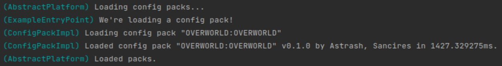

# 监听事件

与 Terra API 交互的一大基础就是[事件](../../terra-api/api-concepts/events.md)监听。

## ConfigPackPreloadEvent

在本教程中，我们会监听 [ConfigPackPreloadEvent](https://ci.codemc.io/job/PolyhedralDev/job/Terra/javadoc/com/dfsek/terra/api/event/events/config/pack/ConfigPackPreLoadEvent.html)。顾名思义，这个事件会在地形包内的配置被读取时触发。附属可以通过监听这个事件实现：

* 注册配置载入器
* 注册配置类型
* 注册对象

本示例中，我们会在事件触发后向控制台发送消息。

## 监听事件

为了监听事件，我们需要用到 [FunctionalEventHandler](https://ci.codemc.io/job/PolyhedralDev/job/Terra/javadoc/com/dfsek/terra/api/event/functional/FunctionalEventHandler.html) API。若要了解功能事件处理器的详细内容，请[点击这里](../../terra-api/api-concepts/events.md)。

### 注入所需对象

在访问功能事件处理器前，我们需要先访问 EventManager，因此，我们需要一个 [Platform](https://ci.codemc.io/job/PolyhedralDev/job/Terra/javadoc/com/dfsek/terra/api/Platform.html) 实例。稍后我们也会用到 [BaseAddon](https://ci.codemc.io/job/PolyhedralDev/job/Terra/javadoc/com/dfsek/terra/api/addon/BaseAddon.html)，因此将其一并注入：

``` Java
@Inject
private Platform platform;

@Inject
private BaseAddon addon;
```

::: info

如果你需要依赖注入刷新器，可以在[这里](../../terra-api/api-concepts/dependency-injection.md)了解更多。

:::

### 创建事件情境

EventContext 用于定义事件处理器。事件情境类似于构建器对象，你可以用它修改处理器的数下。首先为 ConfigPackPreLoadEvent 创建一个事件情境：

``` Java
platform.getEventManager()
        .getHandler(FunctionalEventHandler.class)
        .register(addon, ConfigPackPreLoadEvent.class)
        .then(event -> {
            logger.info("正在尝试重载配置包！");
        });
```

重新编译并安装附属，你应该...什么都看不到。

## 事件范围

Terra 的部分事件包含*范围*。这意味着它们只能在满足条件时触发并应用于附属。ConfigPackPreLoadEvent 就是其中之一。

### 包事件

如果你正在寻找 ConfigPackPreLoadEvent 的结构的话，你可以看到它实现了 [PackEvent](https://ci.codemc.io/job/PolyhedralDev/job/Terra/javadoc/com/dfsek/terra/api/event/events/PackEvent.html) 接口。所有集成这个接口的*范围*都限制在*包*内。这表示它们的处理器只会在注册了处理器的附属被配置包依赖时触发。

所以，你要如何触发你的事件处理器？

### 包依赖

在包的验证文件（`pack.yml`）中，有一个称为 `addons` 的剑。这里的附属都是配置包的依赖。若要接收这个包触发的事件，只需将你的附属和版本范围添加至此即可。打开文件并修改默认包，将你的附属作为依赖导入：

``` YAML
addons:
  biome-provider-pipeline: "0.1.+"
  biome-provider-single: "0.1.+"
  chunk-generator-noise-3d: "0.1.+"
  config-biome: "0.1.+"
  config-flora: "0.1.+"
  config-noise-function: "0.1.+"
  config-ore: "0.1.+"
  config-palette: "0.1.+"
  config-distributors: "0.1.+"
  config-locators: "0.1.+"
  config-feature: "0.1.+"
  structure-terrascript-loader: "0.1.+"
  structure-sponge-loader: "0.1.+"
  language-yaml: "0.1.+"
  generation-stage-feature: "0.1.+"
  structure-function-check-noise-3d: "0.1.+"
  palette-block-shortcut: "0.1.+"
  example-addon: "0.1.+" # 我们的示例拓展！（请自行修改你的 ID 和版本）
```

现在，当你再次运行附属时，你应该会在控制台中见到一条载入包时发送的消息：



## 全局事件处理器

另一种*全局*标记事件处理器的方法。通过 [EventContext#global](https://ci.codemc.io/job/PolyhedralDev/job/Terra/javadoc/com/dfsek/terra/api/event/functional/EventContext.html#--) 方法，你可以在事件处理器中消除包的范围限制。这会导致你的处理器强制触发，无论触发它的包是否依赖你的拓展。将处理器标记为全局后看起来会像这样：

``` Java
platform.getEventManager()
        .getHandler(FunctionalEventHandler.class)
        .register(addon, ConfigPackPreLoadEvent.class)
        .then(event -> {
            logger.info("正在尝试载入配置包！");
        })
        .global();
```

::: warning

不建议将局限于某个事件的处理器标记为全局可用！如果这么做，你可能会碰到预期外行为，正常情况下事件应当只能与事件来源的依赖交互。

:::

## 总结

现在，你的附属中有了一个包范围内的事件监听器，会在 [ConfigPackPreLoadEvent](https://ci.codemc.io/job/PolyhedralDev/job/Terra/javadoc/com/dfsek/terra/api/event/events/config/pack/ConfigPackPreLoadEvent.html) 初次载入时触发。下一章我们将会讲述如何注册对象！

本章节的示例拓展如下：

``` Java
package com.example.addon;

import com.dfsek.terra.addons.manifest.api.AddonInitializer;
import com.dfsek.terra.api.Platform;
import com.dfsek.terra.api.addon.BaseAddon;
import com.dfsek.terra.api.event.events.config.pack.ConfigPackPreLoadEvent;
import com.dfsek.terra.api.event.functional.FunctionalEventHandler;
import com.dfsek.terra.api.inject.annotations.Inject;
import org.slf4j.Logger;

public class ExampleEntryPoint implements AddonInitializer {
    @Inject
    private Logger logger;

    @Inject
    private Platform platform;

    @Inject
    private BaseAddon addon;

    @Override
    public void initialize() {
        logger.info("你好，世界！");

        platform.getEventManager()
                .getHandler(FunctionalEventHandler.class)
                .register(addon, ConfigPackPreLoadEvent.class)
                .then(event -> {
                    logger.info("正在尝试载入配置包！");
                });
    }
}
```