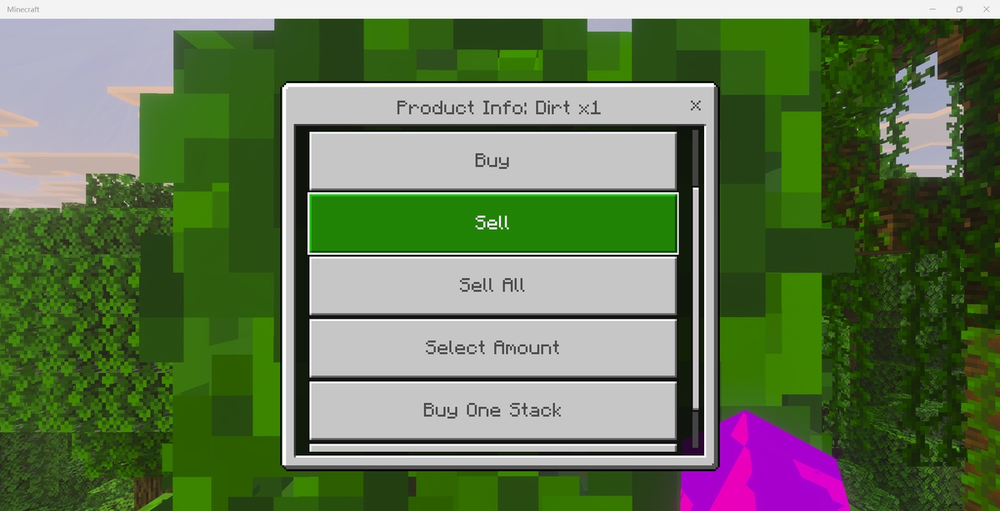
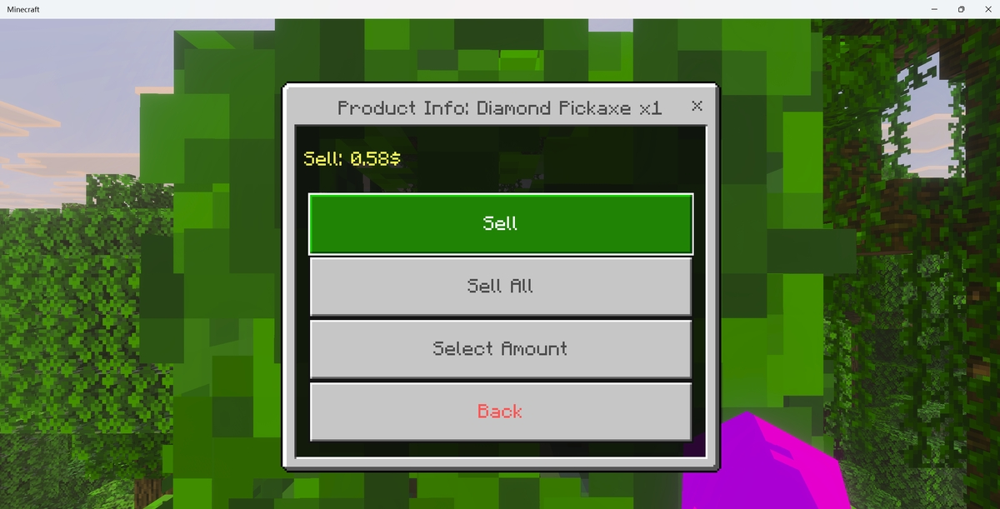

# 🎮 自定义点击事件 - 仅付费版

* 自 2.5.1 起，你可以在商店界面中使用自定义点击事件。
* 在 `config.yml` 下找到这些配置：

``` YAML
  # 可填入的值：https://hub.spigotmc.org/javadocs/spigot/org/bukkit/event/inventory/ClickType.htm
  # 支持用 ;; 符号使用多个点击类型.
  click-event:
    buy: 'SHIFT_LEFT'
    sell: 'RIGHT'
    buy-or-sell: 'LEFT'
    # 若你需要禁用 select-amount 功能, 请将该项设置为 NEVER.
    select-amount: 'SHIFT_RIGHT'
    sell-all: 'DROP'
    buy-one-stack: 'SWAP_OFFHAND'
  # 商店菜单的自定义点击动作.
  # 仅付费版本.
  click-event-actions:
    buy-one-stack:
      display-name: '购买一组'
      buy-only: true
      1:
        type: buy
        shop: '{shop}'
        item: '{item}'
        amount: 64
    sell-one-stack:
      display-name: '出售一组'
      sell-only: true
      1:
        type: sell
        shop: '{shop}'
        item: '{item}'
        amount: 64
```

* 在这里我们创建了一个新的自定义点击事件，称为 `buy-one-stack`。在这个自定义事件中，我们会执行一个购买一组物品的动作。
* 在重启服务器后，若你在一个物品上按下了 **F** 键（或对应“切换副手”的键），我们会执行你在 `click-event-actions` 设置的动作，即购买一组物品。

::: info

商品中的自动描述追加与点击事件的实现代码不在同一处，插件无法基于你的点击事件自动生成合适的追加描述。我的意思是：如果你修改了自定义点击时间内，例如，如果你想要右键点击购买商品而不是默认的出售商品，非常可续，你需要手动修改追加描述的内容，才能让商品下的提示正确显示为“右键点击购买物品”。

:::

## 选项

每个 `click-event-actions` 中的内容都可以像上述例子一样填入如下选项： 

* `display-name`：展示的名称。
* `buy-only`：这个按钮只会在物品可以购买（有买价）时显示。
* `sell-only`：这个按钮只会在物品可以出售（有卖价）时显示。

这些选项只在基岩版表单或 Java 新版的对话界面中生效。

## 展示





在这个示例中，**购买一组**按钮只在商品有买价时显示。

## 示例：仅增量购买菜单

在本示例中，玩家只能通过增量菜单选定数量后购买或出售商品，左侧按钮触发增量购买操作，而右侧按钮触发增量出售操作。

::: info

记得更新描述追加配置，让商品配置正确显示点击事件的信息。

:::

``` YAML
  # 支持填入的值：https://hub.spigotmc.org/javadocs/spigot/org/bukkit/event/inventory/ClickType.html
  # 支持使用 ;; 表示使用多种点击类型。
  click-event:
    buy: 'NEVER'
    sell: 'NEVER'
    buy-or-sell: 'NEVER'
    select-amount: 'NEVER'
    sell-all: 'NEVER'
    buy-more-buy: 'LEFT'
    buy-more-sell: 'RIGHT'
  # 商店菜单的自定义点击事件。
  # 仅付费版本。
  click-event-actions:
    buy-more-buy:
      display-name: '购买'
      buy-only: true
      1:
        type: buy_more_menu
        shop: '{shop}'
        item: '{item}'
        buy-more-menu:
          menu: buy-more-buy
          max-amount: 128
    buy-more-sell:
      display-name: '购买'
      sell-only: true
      1:
        type: buy_more_menu
        shop: '{shop}'
        item: '{item}'
        buy-more-menu:
          menu: buy-more-sell
          max-amount: 128  
```