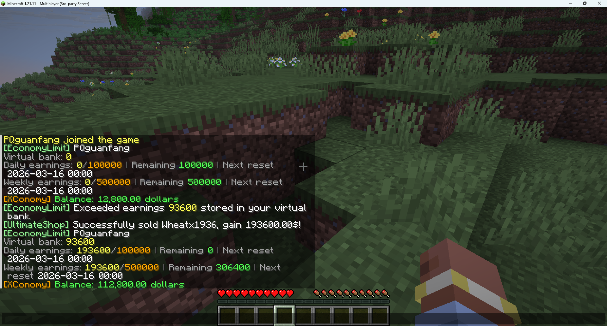

# 🌈 收益限制

## EconomyLimit

* EconomyLimit 是一个基于 Vault 经济接口的收益限制插件。 它通过字节码注入拦截经济插件的加钱方法，统计玩家获得的收益，并按照你配置的规则进行限制。

* 当玩家在某个规则周期内达到收益上限后，超出的金额不会直接消失，而是自动转入插件提供的虚拟银行。 玩家可以之后手动提取虚拟银行中的金额，但提取行为依然会计入收益统计，如果当前规则已经超限，则无法提取。

* 请注意：使用经济插件自身的 pay、give 等指令交易可能不会被插件检测到，因为这些经济插件内部操作可能不会经过 Vault。

### 插件支持：

* 多条收益规则同时生效
* 每条规则独立重置周期
* 条件化限额
* 虚拟银行存取
* 多语言显示
* SQLite / MySQL / PostgreSQL / H2 数据库存储
* Paper / Spigot 双平台文本兼容
* display-name 使用 {lang:...} 按玩家语言动态显示

[点击下载](https://www.spigotmc.org/resources/economylimit-limit-your-player-earnings-by-anyway-daily-weekly-monthly-1-20-1-21-11.133458/)



## 安装步骤

1. 安装 `Vault`
2. 安装任意支持 `Vault` 的经济插件
3. 将 `EconomyLimit` 插件，放入 plugins 文件夹
4. 启动服务器至少一次，生成配置文件
5. 编辑数据库、消息及规则配置
6. 重启服务器或输入命令 `/economylimit reload`
7. 输入命令 `/economylimit debug` 确认注入成功

## 命令列表

### 玩家命令

* `/economylimit` 浏览银行存款与规则进度
* `/economylimit status` 浏览银行存款与规则进度
* `/economylimit withdraw <amount>` 从虚拟银行中取款

### 管理员命令

* `/economylimit status <player>` 浏览其他玩家的银行与进度
* `/economylimit reload` 重载配置文件与消息文本
* `/economylimit debug` 浏览 Vault 注入状态、对接提示与错误

## 权限

* `economylimit.withdraw`
* `economylimit.admin.status`
* `economylimit.admin.reload`
* `economylimit.admin.debug`

## 配置文件

所有限制规则都存储在 `config.yml` 中，示例如下：

``` YAML
rules:
  daily:
    display-name: "{lang:rules.daily.name}"
    reset:
      mode: DAILY
      time: "00:00"
    limits:
      - limit: 50000
      - condition:
          type: PERMISSION
          value: economylimit.rule.daily.vip
        limit: 100000
      - condition:
          type: PERMISSION
          value: economylimit.rule.daily.bypass
        limit: -1
```

### 条件类型

* `ANY`
* `PERMISSION`
* `WORLD`
* `PLAYER`
* `OP`

## 变量列表

### 银行存款

``` txt
%economylimit_bank_balance%
%economylimit_bank%
```

返回玩家当前虚拟银行的存款。

### 规则名称

``` txt
%economylimit_rule_<规则ID>_name%
```

示例：

``` txt
%economylimit_rule_daily_name%
%economylimit_rule_weekly_name%
```

返回规则的名称。

### 当前获取数量

``` txt
%economylimit_rule_<规则ID>_earned%
%economylimit_rule_<规则ID>_progress%
%economylimit_rule_<规则ID>_current%
```

示例：

``` txt
%economylimit_rule_daily_earned%
```

返回玩家在当前轮次的限制规则之下的获取货币数量。

### 规则限制

``` txt
%economylimit_rule_<规则ID>_limit%
```

示例：

```
%economylimit_rule_daily_limit%
```

返回玩家当前限制规则的货币获取上限。\
如果在该规则内玩家没有上限，则返回语言配置文件中 `status.unlimited` 的对应内容。

### 剩余获取量

``` txt
%economylimit_rule_<规则ID>_remaining%
```

示例：

```
%economylimit_rule_daily_remaining%
```

返回玩家在当前轮次的限制规则中还能获取多少货币。

### 下次重置时间

``` txt
%economylimit_rule_<规则ID>_next_reset%
%economylimit_rule_<规则ID>_reset%
```

示例：

``` txt
%economylimit_rule_daily_next_reset%
%economylimit_rule_weekly_reset%
```

返回规则距离下次重置的剩余时间。\
若规则永不重置，则返回语言配置文件中 `status.never` 的对应内容。