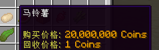

# 🔢 数字格式

* 下载并安装 PlaceholderAPI。

* 通过 `/papi ecloud download` 命令下载 Formatter 变量拓展。[点此](../../PlaceholderAPI/user-guides/placeholder-list.md#formatter)了解详情。
* 编辑物品价格选项，将其改为如下内容：
    `%formatter_number_format_{amount}%`

如：

``` YAML
  C:
    price-mode: CLASSIC_ALL
    product-mode: CLASSIC_ALL
    products:
      1:
        material: potato
        amount: 1
    buy-prices:
      1:
        economy-plugin: Vault
        amount: 20000000
        placeholder: '&6%formatter_number_format_{amount}% Coins'
        start-apply: 0  
```



* 自 2.3.2 版本开始，你可以在 `config.yml` 中让插件帮你修改 `{amount}` 变量，而非手动修改！

``` YAML
placeholder:
  auto-settings:
    # 若启用, 我们会尝试修改价格变量中的 {amount} 为你在这里设置的东西.
    change-amount-in-all-price-placeholder:
      enabled: true # <--- 将此项修改为 true
      replace-value: '%formatter_number_format_{amount}%' # <--- 在这里修改成一样的
```