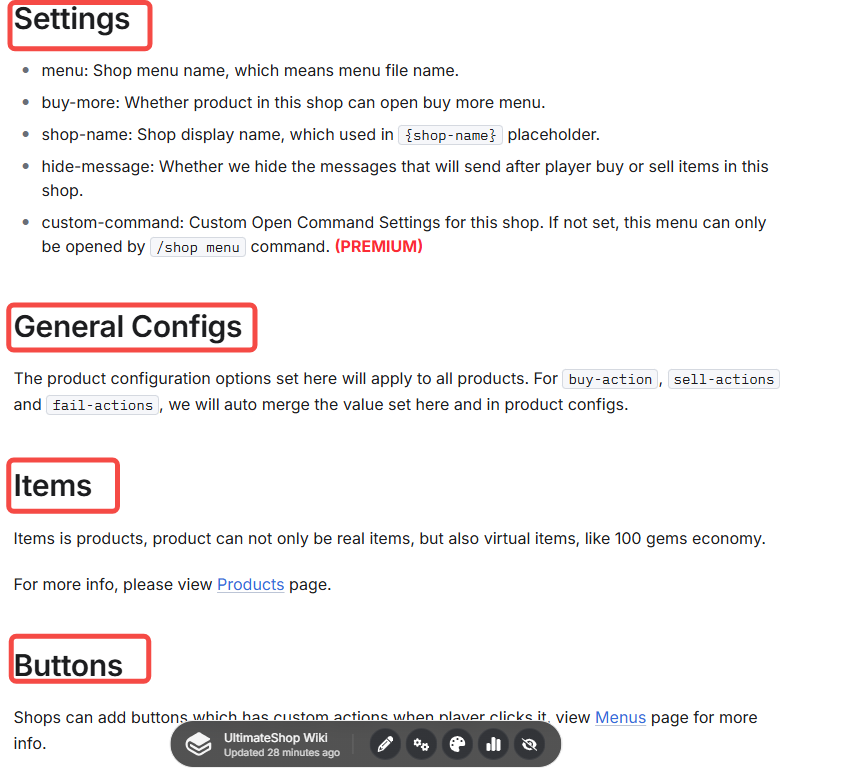
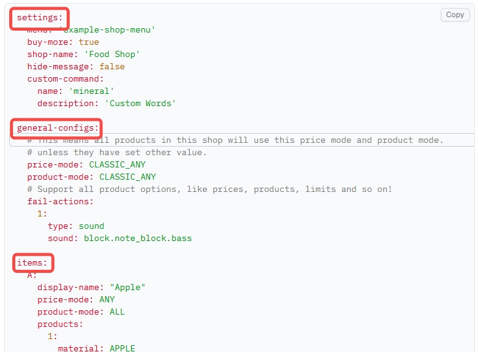
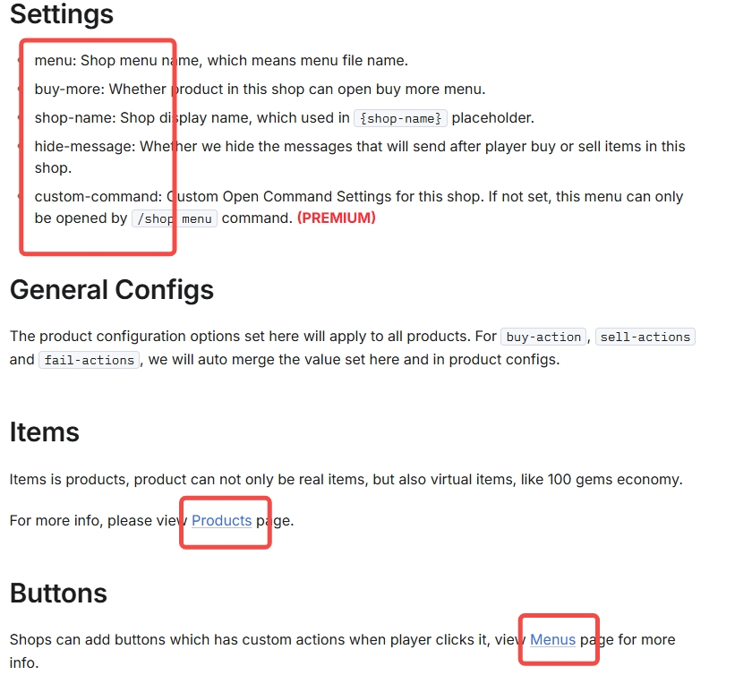
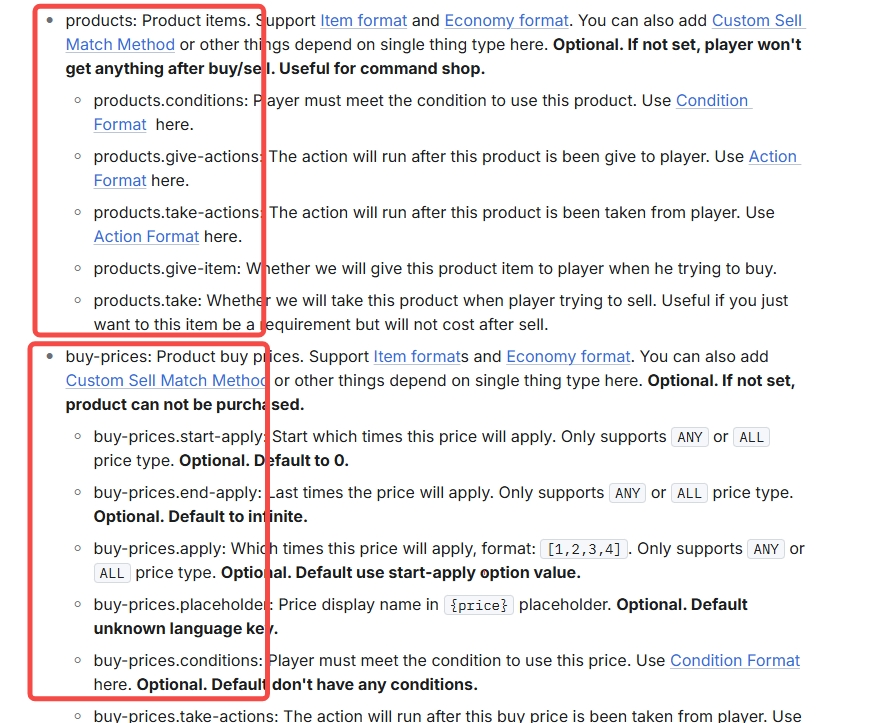
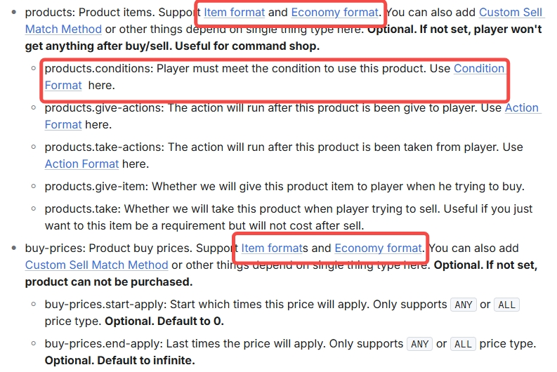

# 📊 理解 YAML/本维基

在本插件中，配置均使用 YAML 格式。理解 YAML 语法是自定义商店配置的基础。让我们利用插件的真实示例讲解语法吧。

## 基础格式

YAML 语法的基础格式为 `键: 值`，如：

``` YAML
debug: false
```

规则：

1. 键名大小写敏感。
2. 冒号后必须有一个空格。
3. 键值包含特殊字符时（如 `:` 或 `&`），请用英文引号将其包裹：`prefix: "&a[UltimateShop]"`
4. 当键值有英文单引号 `'` 时，再用一个引号 `'` 或反斜杠 `\` 对其转义：`message: "You can''t buy this item!"`

## 层级与缩进

层级表示 YAML 中的成员归属关系。每个层级都有两个空格作为缩进。例如：

``` YAML
auto-save:
  hide-message: false
```

在这里：

* `auto-save` 为父键。
* `hide-message` 为子键，意味着它只在自动保存部分的设置下有效。
* `false` 为值，表示我们不会在自动保存时隐藏提示消息。

以较复杂的商店配置为例：

``` YAML
settings:
  menu: 'example-shop-menu'
  buy-more: true
  shop-name: '方块商店'
  hide-message: false
items:
  A:
    price-mode: CLASSIC_ALL
    product-mode: CLASSIC_ALL
    products:
      1:
        material: GRASS_BLOCK
        amount: 1
    buy-prices:
      1:
        economy-plugin: Vault
        amount: '0.63'
        placeholder: '{amount}$'
```

1️⃣ 一级（顶级）有两个根键：

* `settings`
* `items`

它们各自存在于配置的最顶部。这是商店配置，因此你可以在“[商店](../shops/index.md)”页面找到更完整的配置解释。里面的标题会标出所有可以填入这里的配置项。



同时也有更详细的说明。





2️⃣ 二级 `settings` 下的键:

* `menu`
* `buy-more`
* `shop-name`
* `hide-message`\
  这些都是 `settings` 的**子键**。

它们都是商店的设置。放在其他地方<font color="red">**无效**</font>。

在 `items` 下：

* `A` 是表示商店类别或一组物品的**子键**。`A` 表示商品的 ID 是 `A`，所有其下的配置都只会对它生效。

``` YAML
items:
  buy-prices: # 无效
    1:
      economy-plugin: Vault
      amount: '0.63'
      placeholder: '{amount}$'
  A:
    menu: 'example-shop-menu' ## 无效。
    buy-more: true ## 无效。
    shop-name: 'Blocks Shop' ## 无效。
    hide-message: false ## 无效。
    price-mode: CLASSIC_ALL ## 仅对 A 有效。
    product-mode: CLASSIC_ALL ## 仅对 A 有效。
    products: # 仅对 A 有效。
      1:
        material: GRASS_BLOCK
        amount: 1

```

3️⃣ A -> 位于 `items` 的配置:

* `price-mode`
* `product-mode`
* `products`
* `buy-prices`
* 等内容\
  都是 `A` 的**子键**，这些都只对 A 生效。且不应填到其他地方。



这是商品配置，你可以在“[商品](../shops/products.md)”章节浏览各个设置的详细信息。

``` YAML
items: # 有效。
  B: # 有效。
    products: # 有效。
      1: # 有效。
        material: APPLE ## 有效。
        amount: 64 ## 有效。
        give-actions: # 有效。
          1: # 有效。
            multi-once: true ## 有效。
            type: message ## 有效。
            message: 'eco give {player} {amount}' ## 有效。
```

4️⃣ `products` 下的四级键:

* `1` 表示它是第一个定义的商品。位于 `buy-prices`。
* `1` 也表示第一个定义的价格组。
* 你可以设置数量不限的价格和物品。所有选项都可以在“[单条目](../shops/products-config-single-thing/index.md)”章节详细浏览。

5️⃣ `products` -> `1` 下的五级键:

* `material: GRASS_BLOCK` -> 物品类型。
* `amount: 1` -> 物品数量。

这里使用的是“[物品格式](itemformat/index.md)”。

在 `buy-prices` -> `1` 下：

* `economy-plugin: Vault` -> 使用的经济类型。
* `amount: '0.63'` -> 价格。
* `placeholder: '{amount}$'` -> 价格展示样式。

这里使用的是“[经济格式](economyformat.md)”和价格部分的变量选项。



## 结构树状图

``` fish
settings
│
├─ menu
├─ buy-more
├─ shop-name
└─ hide-message

items
└─ A
   ├─ price-mode
   ├─ product-mode
   ├─ products
   │   └─ 1
   │      ├─ material
   │      └─ amount
   └─ buy-prices
       └─ 1
          ├─ economy-plugin
          ├─ amount
          └─ placeholder
```

## 列表

当一个键需要多个元素时，这种数据类型即为列表。

示例：

``` YAML
menu:
  secret-shop-items:
    - diamond_sword
    - netherite_pickaxe
    - enchanted_golden_apple
```

每个 `-` 都必须在父键的基础上再缩进两个空格。

## 空值与默认值

空列表的格式如下：

``` YAML
menu:
  secret-shop-items: []
```

`[]` 表示空列表，插件则会使用默认设置。\
这行配置可以安全删除。