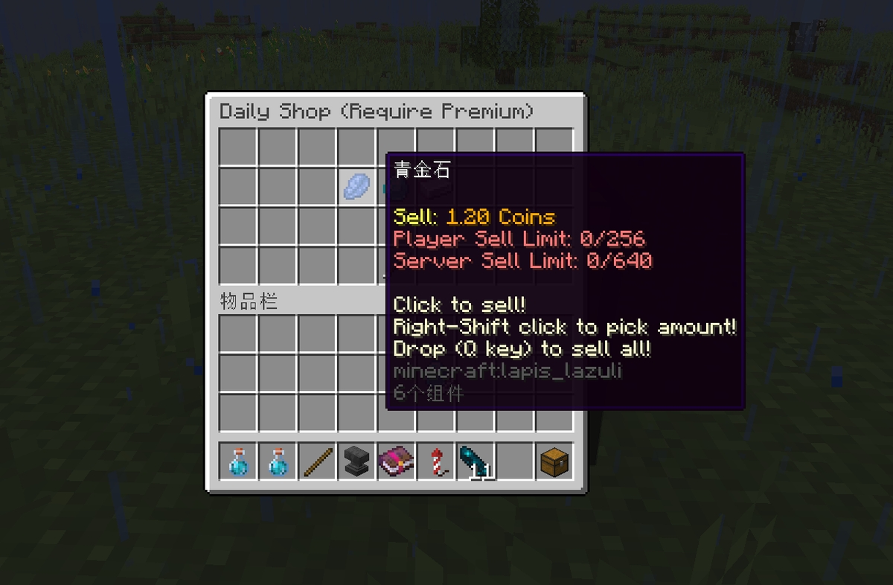

# 📅 示例：每日商店/轮换商店

::: info

此示例只在<font color="red">**付费版**</font>的 **UltimateShop** 环境下有效！

这个示例利用随机变量在商店中展示不同物品，你也可以利用条件变量实现不同条件展示不同物品。有关示例请见[这里](../placeholders/conditional-placeholder-premium.md#示例条件商品)。

:::

## 创建随机变量

我们需要先创建随机变量。这个变量可以与[条件](../format/condition-format.md)组合使用，来实现每天商店中产生不同物品，以此完全达到每日商店插件的效果。

在本示例中，我们在 `random_placeholder` 文件夹下创建了一个名为 `daily.yml` 的随机变量文件。选项如下所述：

* `reset-mode` 与 `reset-time`：变量会每天刷新。
* `element-amount`：这个变量会在刷新时随机选择五个元素，与商店中刷新的物品数量一致。
* `elements`：返回内容决定了商店中出现的物品。所以元素的数量应当与商店中可能出现的物品数量相同。


* 在本示例中，每日商店会有五个格子，七个不同的物品，意味着每天都会隐藏随机的两个物品，剩余五个物品则会被展示在商店的货架上。
* 请参阅“[随机变量](../placeholders/random-placeholder-premium.md)”章节来获取更多有关随机变量的信息。

``` YAML
reset-mode: TIMED
reset-time: '00:00:00'
per-player-element: false
element-sort: true
element-amount: 5
elements:
  - 'A'
  - 'B'
  - 'C'
  - 'D'
  - 'E'
  - 'F'
  - 'G'
```

## 配置商店

本示例使用的多个选项都在“[商店](index.md)”章节中提及。如果你对其中的选项功能有疑问，可以前往这个章节了解。

``` YAML
settings:
  menu: 'daily-shop-menu' # The menu ID
  buy-more: true
  shop-name: '每日商店（需付费版）'
  hide-message: false

general-configs:
  price-mode: CLASSIC_ANY
  product-mode: CLASSIC_ANY
  sell-limits:
    global: 640
    default: 18
    vip: 256
  sell-limits-conditions:
    vip:
      1:
        type: permission
        permission: 'group.vip'
  sell-times-reset-mode: 'COOLDOWN_TIMED'
  sell-times-reset-time: '{random_reset}'

items:
  A:
    products:
      1:
        material: REDSTONE
        amount: 1
    sell-prices:
      1:
        economy-plugin: Vault
        amount: 1
        placeholder: '&6{amount} 枚硬币'
        start-apply: 0
  B:
    products:
      1:
        material: IRON_INGOT
        amount: 1
    sell-prices:
      1:
        economy-plugin: Vault
        amount: 3
        placeholder: '&6{amount} 枚硬币'
        start-apply: 0
  C:
    products:
      1:
        material: GOLD_INGOT
        amount: 1
    sell-prices:
      1:
        economy-plugin: Vault
        amount: 1.6
        placeholder: '&6{amount} 枚硬币'
        start-apply: 0
  D:
    products:
      1:
        material: COPPER_INGOT
        amount: 1
    sell-prices:
      1:
        economy-plugin: Vault
        amount: 2
        placeholder: '&6{amount} 枚硬币'
        start-apply: 0
  E:
    products:
      1:
        material: DIAMOND
        amount: 1
    sell-prices:
      1:
        economy-plugin: Vault
        amount: 0.8
        placeholder: '&6{amount} 枚硬币'
        start-apply: 0
  F:
    products:
      1:
        material: LAPIS_LAZULI
        amount: 1
      2:
        material: EMERALD
        amount: 1
    sell-prices:
      1:
        economy-plugin: Vault
        amount: 1.2
        placeholder: '&6{amount} 枚硬币'
        start-apply: 0
      2:
        economy-plugin: Vault
        amount: 3.3
        placeholder: '&6{amount} 枚硬币'
        start-apply: 0
  G:
    products:
      1:
        material: EMERALD
        amount: 1
    sell-prices:
      1:
        economy-plugin: Vault
        amount: 5
        placeholder: '&6{amount} 枚硬币'
        start-apply: 0
```

## 配置菜单

这个示例中使用的多个选项在“[菜单](../menus/general-menus.md)”章节有所提及。如果你不知道它们的用法，请前往查询。

``` YAML
# 仅付费版本。

title: '{shop-name}'
size: 36

open-actions:
  1:
    type: sound
    sound: item.book.page_turn

dynamic-layout: true

layout:
  - '000000000'
  - '000`{random_daily;;1}``{random_daily;;2}``{random_daily;;3}`000'
  - '000000000'
  - 'a0003000b'

buttons:
  3:
    display-item:
      material: ARROW
      name: '&c« 返回'
    actions:
      1:
        type: open_menu
        menu: main
```

