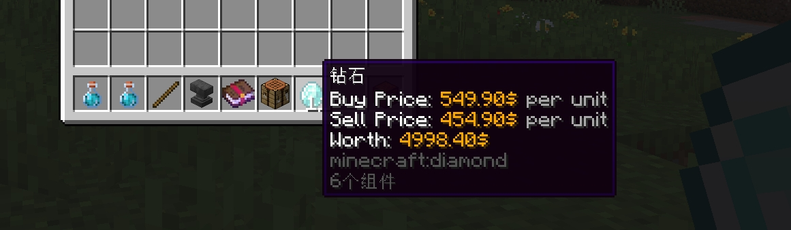

# 💰 物品配置：单条目

每个在出售物品中的单独物品或价格即为**单条目**。所以，每个物品都有这些类型：

* 购买价格：物品的买价，玩家需要支付对应货币购买这个物品，若不存在（即 `buy-prices` 部分不存在于配置），则该物品不可以被购买。
* 出售价格：物品的卖价，玩家向商店出售物品后可获得的货币数量，若不存在（即 `sell-prices` 部分不存在于配置），则该物品不可以被出售。
* 物品：参与交易的物品，玩家会在交易之后得到或失去对应物品。

## 单条目类型

每种内容类型都可设置不限数量的内容，例如设置五种购买价格、一百种出售价格甚至是获得一千个物品！

每个单条目都拥有如下类型：

* 原版物品：通过“[物品格式](../format/itemformat/index.md)”让我们知道你需要在商店中向玩家出售或收取什么原版物品。**（购买/出售/物品）**
* 挂钩物品：通过“[支持插件](../info/compatibility.md#直接支持的自定义物品系列)”的物品让我们知道你需要在商店中向玩家出售或收取什么物品。该类型同样使用“[物品格式](../format/itemformat/index.md)”。**（购买/出售/物品）**
* 匹配物品：通过“[自定义物品匹配方法](../features/custom-item-match-method.md)”来让我们知道你需要匹配什么物品。**（购买/物品）**
* 原版经济/挂钩经济：通过“[经济格式](../format/economyformat.md)”让我们知道你需要在商店中给予或收取玩家什么货币。
* 自定义：若上述类型都没能满足你的要求，你可以创建自己的单条目！你需要在单条目配置中添加一个 `match-placeholder` 选项，让插件知道这个自定义物品/价格当前的数量，然后我们会比较你在这里设置的数值。在上述的示例中，我们会比较玩家的生命值。**如果你的经济插件不受支持，只需将其的经济变量放入这里即可解决！（出售/物品）**<font color="red">**（仅付费版）**</font>
* 免费：不包含物品格式、经济格式、`match-item` 部分和 `match-placeholder` 部分的物品视作免费。

## 选项

``` YAML
  A:
    price-mode: ALL
    product-mode: CLASSIC_ANY
    products:
      1:
        material: emerald
      2:
        material: diamond
    buy-prices:
      1:
        economy-plugin: Vault
        amount: '55+({buy-times-server}-{sell-times-server})*0.1'
        max-amount: 5500
        min-amount: 325
        placeholder: '{amount}$'
        start-apply: 0
      2:
        economy-plugin: PlayerPoints
        amount: '2'
        placeholder: '{amount}$'
        start-apply: 5
        end-apply: 15
    sell-prices:
      1:
        economy-plugin: Vault
        amount: '15'
        max-amount: 455
        min-amount: 1
        placeholder: '{amount}$'
        start-apply: 0 
  B:
    products:
      1:
        # 出售物品
        material: APPLE
        amount: 64
        give-actions:
          1:
            multi-once: true
            type: message
            message: 'eco give {player} {amount}'
    buy-prices:
      1:
        # 购买匹配变量
        match-placeholder: '%player_health%'
        placeholder: '{amount}$'
        amount: 5
        take-actions:
          1:
            multi-once: true
            type: console_command
            command: 'eco take {player} {amount}'
    sell-prices:
      1:
        # 出售给予命令
        give-actions:
          1:
            type: 'message'
            message: 'eco give {player} {amount} 1'
        amount: 500
        placeholder: '{amount}$'
```

在物品配置中，我们通过几个选项配置了对应类型的单条目。根据你需要的类型，在这些选项中填入了对应的内容。部分选项有一些额外内容可填入，如下：

* `products`：用于出售的物品。支持“[物品格式](../format/itemformat/index.md)”与“[经济格式](../format/economyformat.md)”。你也可以根据单条目内容添加[自定义出售匹配方法](../features/custom-item-match-method.md)。**可选。若不设置，玩家在交易后不会获得任何东西。适用于命令商店。**
    * `products.conditions`：玩家必须达到指定条件才可以购买这个物品。在此使用“[条件格式](../format/condition-format.md)”。
    * `products.give-actions`：在物品基于玩家后执行的动作。在此使用“[动作格式](../format/action-format.md)”。
    * `products.give-item`：在玩家尝试购买时是否直接给予物品。
    * `products.take`：是否在玩家尝试出售物品时扣除物品。如果你不需要消耗物品，这个选项会很有用。
* `buy-prices`：物品的买价。支持[物品格式](../format/itemformat/index.md)与[经济格式](../format/economyformat.md)。你也可以根据单条目内容添加[自定义出售匹配方法](../features/custom-item-match-method.md)。**可选。若不设置则表示物品不可购买。**
    * `buy-prices.start-apply`：在指定次数购买后应用该价格。仅支持 `ANY` 或 `ALL` 定价模式。**可选，默认为 0。**
    * `buy-prices.end-apply`：在指定次数购买后不再应用该价格。仅支持 `ANY` 或 `ALL` 定价模式。**可选。默认为无穷大。**
    * `buy-prices.apply`：应用该价格的购买次数，格式为：`[1,2,3,4]`。仅支持 `ANY` 或 `ALL` 定价模式。**可选。默认使用 `start-apply` 项的值。**
    * `buy-prices.placeholder`：显示在 `{price}` 中的内容。**可选。默认使用配置文件的中的“未知类型”。**
    * `buy-prices.conditions`：玩家必须满足指定条件才可使用该价格。在此使用“[条件格式](../format/condition-format.md)”。**可选。默认不设置条件。**
    * `buy-prices.take-actions`: 购买价格被玩家使用后触发的操作。使用“[动作格式](../format/action-format.md)”。
    * `buy-prices.take`：是否在玩家尝试出售物品时扣除货币。如果你不需要消耗物品，这个选项会很有用。
* `sell-prices`：物品的卖价。支持[物品格式](../format/itemformat/index.md)与[经济格式](../format/economyformat.md)。你也可以根据单条目内容添加[自定义出售匹配方法](../features/custom-item-match-method.md)。**可选。若不设置则表示物品不可出售。**
    * 它也支持所有能填入 `buy-prices` 下的选项。
    * `sell-prices.give-actions`：物品给予玩家后执行的动作，使用“[动作格式](../format/action-format.md)”。**可选。**

## 单条目下的动作与条件

你可能注意到，你可以设置在单条目给予玩家时触发的动作，以及设置玩家使用该单条目的条件。这对于你播放声音或在玩家交易后执行命令时非常有用。

* 动作：在单条目配置中添加 `give-actions` 部分即可。对于命令商店、权限商店、附魔商店等很有用。另外，**如果你的经济/物品插件不支持 UltimateShop，只需将其给予货币/物品的命令填入这里即可！**（`{player}` 表示玩家名称，`{amount}` 表示价格/物品数量）如果你想要让物品只执行动作，不要忘了在单条目配置中加入 `give-item: false` 设置！
* 条件：只需在单条目配置下添加 `conditions` 部分即可。

### 单条目 `give-actions` 与物品 `actions`/`sell-actions` 的不同之处

* `give-actions` 只会在单条目触发且给予玩家时执行。`buy-actions`/`sell-actions` 总是会在玩家成功购买或出售物品时给予。
* `give-actions` 的 `{amount}` 变量会返回单价格/物品数量，而 `buy-actions`/`sell-actions` 则会返回玩家此次购买或出售的物品数量。
    例如，玩家出售了一组苹果并获得了 100 硬币，则 `give-actions` 的 `{amount}` 变量会返回 100，而 `buy-actions`/`sell-actions` 的变量会返回 64。

## 相似选项

* `products.XXX.conditions` 可被 `products-conditions` 部分替换。
* `buy(sell)-prices.XXX.conditions` 可被 `buy(sell)-prices-conditions section` 部分替换。

如下两个配置在功能上是相同的：

``` YAML
    products:
      1:
        material: REDSTONE
        amount: 1
    products-conditions:
      1: 
        type: placeholder
        placeholder: '{random_daily-1}'
        rule: '=='
        value: 'A'
```

``` YAML
    products:
      1:
        material: REDSTONE
        amount: 1
        conditions:
          1:
            type: placeholder
            placeholder: '{random_daily-1}'
            rule: '=='
            value: 'A'
```

自 3.4.3 版本开始，你可以指定**单条目条件**的**键名**。如果你确认你的物品、买价及卖价均使用相同条件，你就可以将它们的键名设置为相同的值，而无需为每条内容单独配置。你可以在 `config.yml` 下找到这些设置：

``` YAML
conditions:
  products-key: 'conditions'
  buy-prices-key: 'conditions'
  sell-prices-key: 'conditions'
  display-item-key: 'conditions'
```

这个示例让所有 `conditions` 都变得相同，因此商店配置会变成这样：

``` YAML
items:
  A:
    price-mode: CLASSIC_ANY
    product-mode: CLASSIC_ANY
    products:
      one:
        material: REDSTONE
        amount: 1
        give-actions:
          1:
            type: message
            message: '你好!'
      two:
        material: IRON_INGOT
        amount: 1
    sell-prices:
      one:
        economy-plugin: Vault
        amount: 1
        placeholder: '&6{amount} 硬币'
        start-apply: 0
      two:
        economy-plugin: Vault
        amount: 3
        placeholder: '&6{amount} 硬币'
        start-apply: 0
    conditions:
      one: # 条件 ID
        1: # 表示第一个条件
          type: placeholder
          placeholder: '{random_daily}'
          rule: '=='
          value: 'A'
      two:
        1:
          type: placeholder
          placeholder: '{random_daily}'
          rule: '=='
          value: 'B'
```

## 物品描述自动展示价格

* 下载并安装 [MythicChanger](https://www.spigotmc.org/resources/mythicchanger-auto-match-change-drag-change-gui-change-in-1-plugin-1-14-1-21-8.98523/)（此插件依赖 PacketEvents）。
* 在 `plugins/MythicChanger/rules` 文件夹中新建一个 `shop-display.yml` 文件。
* 粘贴如下内容，保存并重启服务器。

``` YAML
weight: 15
only-in-player-inventory: true
fake-changes:
  add-price-lore:
    - '&f买价：&6{buy-price} &7/个'
    - '&f卖价：&6{sell-price} &7/个'
    - '&f总价：&6{total-price}'
```

