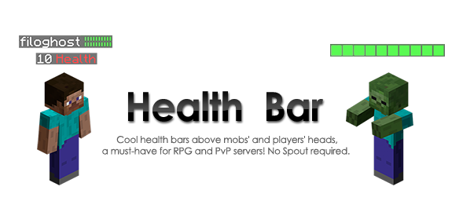
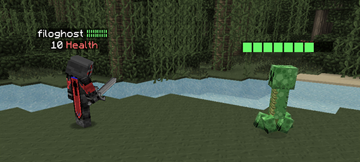

<!-- resoource:info_spigot -->
---
resource-id：'104616'
tested-version：['1.17','1.18','1.19','1.20']
source-code：'https://github.com/DavideBlade/HealthBar-Reloaded'
contributer：['filghost']
---

<!-- resource:description -->

     

[插件](https://dev.bukkit.org/projects/health-bar)由 [filoghost](https://github.com/filoghost) 在 2013 发起，在 2016 停更，下载超 950,000 次。现在已经完全更新。我希望它还能像几年前那样有用。:)

## 插件特色

* 自定义生物头顶的名称（自定义名称、血量显示）！
* 自定义玩家的血量显示，显示为前后缀或其他自定义选项（见维基的[自定义章节](https://github.com/DavideBlade/HealthBar-Reloaded/wiki/Customization)）
* 保持显示的设置
* 在一段时间后消失
* 无需 Spout 或客户端模组
* 即装即用
* 分世界显示
* 在插件有更新可用时（通过重载）显示在控制台
* 在玩家名称下显示血量（名称可自定义，但不可在此显示血量条。[为什么？](https://github.com/DavideBlade/HealthBar-Reloaded/wiki/FAQ)）
* 在自定义名称实体上显示血条，不影响原有名称
* 开发者 API

## 插件图片

## 兼容性

本插件与下列插件兼容：

* [ScoreboardStatsX](http://dev.bukkit.org/bukkit-plugins/scoreboardstats)
* MobArena（需要将 *override-other-scoreboard* 设置为 *true*）
* McMMO
* Citizens（仅支持实体血条和玩家后缀：见[维基](https://github.com/DavideBlade/HealthBar-Reloaded/wiki/FAQ)）
* MythicMobs（需要将 *hooks.MythicMobs* 设置为 *false*）

<u>**不与**</u>下列插件兼容：

* [Simple Tablist](https://www.spigotmc.org/resources/%E2%98%86-simple-tablist-%E2%98%86%E3%80%8A1-16-x-1-20-x%E3%80%8B-animated-hex-colors.101989/)
* 其他使用了主计分板的插件（你可以通过禁用权限与指定世界来让它们兼容）

