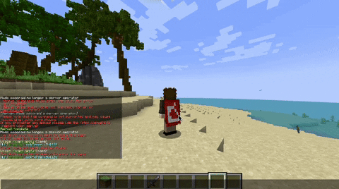
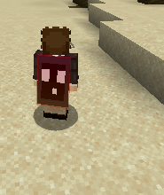
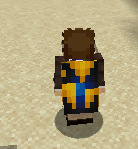

<!-- resoource:info_spigot -->
---
resource-id: '116899'
native-version: ['1.19']
tested-version: ['1.19','1.20','1.20.6']
source-code: 'https://github.com/corentingosselin/ProdigyCape'
contributors: ['Maximde (active and first contributor)']
languages: ['French']
donation-link: 'https://www.paypal.com/donate/?hosted_button_id=56KN7WE2G324C'
---

<!-- resource:description -->

<center>

# 向服务器添加自定义披风

<sup>

甚至不需要模组或纹理包！

</sup>

*展示动图*



## 通过头颅材质创建自己的披风

[你可以通过这个网站生成自己的披风材质](https://minecraft-heads.com/)

 

*配置示例*

```YAML
mojang:
  enabled: true
  texture: eyJ0ZXh0dXJlcyI6eyJTS0lOIjp7InVybCI6Imh0dHA6Ly90ZXh0dXJlcy5taW5lY3JhZnQubmV0L3RleHR1cmUvZjc3MDVlM2U5OTdlNWNlNTIxNjY2M2M5ZTY0YjM5NmZhNDNlZGRlODI1NWZkOTEwZjBjYzgxYTAzMjVlNmIifX19
  name: §4Mojang Staff
  description: §7Mojang 官方披风
  price: 0
  limited_edition: 0
  number_sold: 0
minecon_creeper:
  enabled: true
  texture: eyJ0ZXh0dXJlcyI6eyJTS0lOIjp7InVybCI6Imh0dHA6Ly90ZXh0dXJlcy5taW5lY3JhZnQubmV0L3RleHR1cmUvMzk3NmFhYzc2MjEwYjAzZTRjMzg5MWJkZjc5OTMyMmUzMGE3ZThhMTI3MmIyNzkwMzI2YmYwOGYyMTkyYWNkNiJ9fX0=
  name: §cMinecon 2011
  description: §7Minecon 2011 披风
  price: 0
  limited_edition: 0
  number_sold: 0
minecon_pickaxe:
  enabled: true
  texture: eyJ0ZXh0dXJlcyI6eyJTS0lOIjp7InVybCI6Imh0dHA6Ly90ZXh0dXJlcy5taW5lY3JhZnQubmV0L3RleHR1cmUvNTRlNDM1OGQ3MzRhNmUwNjhlYjA3Y2I4ZmM1ZmZkZThiOTQ4MDBlYjM5Njc3NzQyOGE0ZjU1OTMxNWExZmY0ZCJ9fX0=
  name: §2Minecon 2012
  description: §7Minecon cape from 2012
  price: 0
  limited_edition: 0
  number_sold: 0
```

## 插件命令

/cape help - prodigycape.help - 显示帮助菜单

/cape apply <披风> - 无权限 - 装备已有的披风

/cape menu - prodigycape.menu - 显示披风界面，展示已拥有的披风

/cape shop - prodigycape.shop - 显示披风商城，可购买披风

/cape reload - prodigycape.reload - 重载配置

/cape sync - prodigycape.admin - 与 MySQL 数据库同步 capes.yml 文件

## 权限

单独披风权限：prodigy.cape.<披风名称>

所有披风：prodigy.cape.*

使用禁用的披风：prodigy.cape.bypass

## 兼容性

经 1.19.4 - 1.20.6 的 Paper 及 Spigot 测试，可正常运行

需要安装 [ProtocolLib](https://www.spigotmc.org/resources/protocollib.1997/)！

[Vault 为软依赖](https://www.spigotmc.org/resources/vault.34315/)，安装后才可使用商店

## 免责声明

此为插件初版，可能存在纰漏，我们会尽可能提供高效支持与快速修复

你可以在[这里](https://github.com/corentingosselin/ProdigyCape/issues)提交漏洞报告！

<font color="red">

Mojang 的 EULA 协议不允许你使用现实货币购买披风，违者后果自负

</font>

## 常见问题

### 插件是如何运行的？

它使用了 Minecraft 的自定义头颅材质，并通过新的展示实体功能让它看起来像个披风。

我们让它骑乘在玩家身上，这样会让动画更流畅，内存占用也会更低

它与大部分骑乘玩家的插件兼容

### 你能让它与旧版 Minecraft 兼容吗？

不，展示实体是 1.19.4 之后才被添加的。

### 如果服务器崩溃了，披风能在重启之后可见吗？

不行，披风是发包实现的，崩溃之后它们会消失。

### 如果玩家已经拥有了披风，这会导致冲突吗？

插件会默认禁用官方披风。

### 开发者贡献

我们需要开发者的贡献来让插件变得更好！

- 更真实的披风，背向移动，飞行及游泳姿势下的显示等
- Maven 模块重构
- 更多类型的数据库支持

## 支持

[](https://discord.gg/zXKaWZgR)

### 联系开发者

discord: cocoraid

</center>
