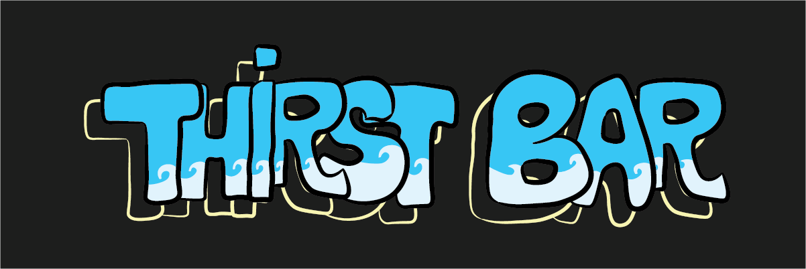
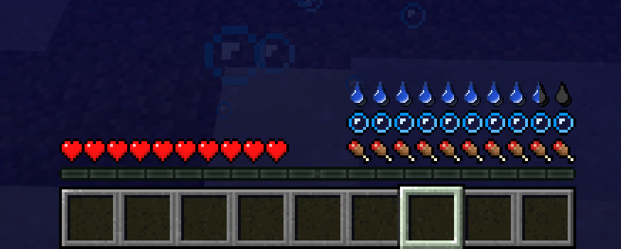

<!-- resoource:info_spigot -->
---
resource-id：'113587'
tested-version：['1.9','1.10','1.11','1.12','1.13','1.14','1.15','1.16','1.17','1.18','1.19','1.20']
source-code：'https://github.com/Vanderis-Team/ThirstBar'
contributer：['Vanderis']
donation-link：'https://www.paypal.com/paypalme/PhapPurple'
---

<!-- resource:description -->

<center>

*想要提交漏洞，提交建议或者讨论新点子吗？*
*请点击图片加入我们的 Discord 聊天群组！*

[](https://discord.gg/eVhprxqC7G)

</center>





你在给服务器找些新脑洞吗？想要在饱食度以外的地方加点料吗？

本插件为你带来了口渴机制及其相关的内容，能很好地和饱食度搭配。

这能让服务器更加生动有趣、和谐友爱（笑）！

**支持插件：**

- PlaceholderAPI
- WorldGuard

## 插件特色

* 加入了口渴值，单位与饥饿值相同，可以在 BossBar 和 ActionBar 中显示。
    * 还可以在饥饿条上方显示，不会与氧气条冲突！
* 口渴度可以显示为整数或者实数。
* 配置文本允许自定义玩家的初始口渴度上限，也可以后期增加。例如，玩家 A 默认有 100 点口渴上限，但通过权限或命令可以提升至 200 点。
* 口渴值会随时间下降，比率大致为 X/Y（X 为每 Y 刻减少的口渴度），可在配置文件中修改。
    * 需要注意的是，Y 越大，插件对性能的占用越大。
* 玩家可以通过吃或喝（自定义物品）来恢复口渴值。这些物品既可以是原版物品、带有自定义名称或描述的物品，也可以是带有自定义模型数据或材质的物品。
    * 蹲下右键空气或水源方块，玩家甚至可以喝雨水或生水。但生水不一定是干净的！管理员可以通过配置文件修改喝生水带来的负面效果。


* 在口渴度到达一定程度时，它在 BossBar 或 ActionBar 的显示颜色会发生变化。除此之外，玩家还会脱水（药水效果）。
    * *例如，在 100% 时，玩家口渴条为绿色且会获得速度 I，而在 25% 时会显示为红色，且玩家会获得缓慢 I。插件允许你修改 ActionBar/BossBar 的显示内容，并添加诸如 [title]、[message]、[sound] 或 [player]/[console] - 这些动作会在玩家口渴低于一定值时触发*


* 在指定世界（配置文本中的 DisabledWorld 选项）或区域（WorldGuard 标志）中禁用口渴度。我们还可以通过修改每个世界/区域中的口渴速度防止口渴度减少。


* 管理员还可以自定义禁用口渴度的模式，例如创造、旁观模式...


* 从河里直接装瓶的水会被视作生水。你可能需要在饮用或者用于炼药之前先将它烧开。


## 命令列表


* /tb reload：重载插件。
* /refresh [玩家名称]：刷新玩家数据。
* /refreshall：刷新所有玩家的数据。
* /tb set <口渴值> [玩家名称]：将玩家口渴度设置为指定值。
* /tb restore <口渴值> [玩家名称]：为玩家恢复一定口渴度。
* /tb reduce <口渴值> [玩家名称]：减少玩家一定口渴度。
* /tb max set <口渴值> [玩家名称]：为玩家设置口渴度上限。
* /tb reset：将所有玩家的最大口渴度重置为默认值。
* /tb disable [玩家名称]：禁用指定玩家的口渴度。
* /tb disableall：禁用所有玩家的口渴度。
* /tb stage <状态> [玩家名称]：将玩家设置为指定的口渴状态。
* /tb stageall <状态>：将所有玩家设置为指定的口渴状态。
* /tb item save <名称> <口渴值>：保存回复口渴度的自定义物品。
* /tb item give <名称> [玩家名称]：将自定义物品给予玩家。

## 权限列表

* thirstbar.help：使用 /tb [页码] & /tb help [页码] 命令的权限。
* thirstbar.reload：使用 /tb reload 命令的权限。
* thirstbar.refresh：对自己使用 /tb refresh 命令的权限。
* thirstbar.refresh.other：对包括自己在内的任何玩家无冷却使用 the /tb refresh 命令的权限。
* thirstbar.refreshall：使用 /tb refreshall 命令的权限。
* thirstbar.set.current：使用  /tb set 命令的权限。
* thirstbar.add：使用 /tb add 命令的权限。
* thirstbar.reduce：使用 /tb reduce 命令的权限。
* thirstbar.set.max：使用 /tb max set 命令的权限。
* thirstbar.reset：使用 /tb reset 命令的权限 。
* thirstbar.disable：使用 /tb disable 命令的权限。
* thirstbar.disableall：使用 /tb disableall 命令的权限。
* thirstbar.stage：使用 /tb stage 命令的权限 。
* thirstbar.stageall：使用 /tb stageall 命令的权限。
* thirstbar.item.save：使用 /tb item save 命令的权限。
* thirstbar.item.give：使用 /tb item give 命令的权限。

## 变量

* %thirstbar_current_int%：当前口渴度（整数）。
* %thirstbar_current_float%：当前口渴度（小数）。
* %thirstbar_max_int%：口渴度上限（整数）。
* %thirstbar_max_float%：口渴度上限（小数）。
* %thirstbar_reduceValue_int%：玩家口渴度减缓量（整数）。
* %thirstbar_reduceTime_int%：玩家口渴度减缓间隔（整数）。
* %thirstbar_reduceValue_float%：玩家口渴度减缓量（小数）。
* %thirstbar_reduceTime_float%：玩家口渴度减缓间隔（小数）。
* %thirstbar_reducePerSec_int%：玩家每秒损失的口渴度（整数）。
* %thirstbar_reducePerSec_float%：玩家每秒损失的口渴度（小数）。
* %thirstbar_isDisabled%：玩家是否启用了口渴机制。

## 配置文件
<details>
<summary>config.yml</summary>

```YAML
Sql:
  Enable: false
  Host: 'localhost'
  Port: '3306'
  Username: 'root'
  Password: '123456'
  Database: 'ThirstBar'
StopDrinking: true # 阻止玩家在不口渴的时候喝水
CustomActionBar: false
Thirsty:
  Max: 100
  Reduce: 1
  Time: 100 # 单位为刻 (20 刻 = 1 秒)
  Damage: 1.5 # 在口渴度为 0 时每单位时间损失 1.5 生命值
CooldownRefresh: 5 # 单位为秒
DisabledGamemode:
  - "CREATIVE"
  - "SPECTATOR"
DisabledWorlds:
  - "world_nether"
DrinkingRawWater:
  Enable: true
  Delay: 10 # 单位为刻
  Value: 5 # 增加口渴度的值
  Reduce: 50
  # 口渴速度会提升 50%
  Duration: 100 # 单位为刻
  TitleActionBar: "&a<value>&f/&b<max> &f- <reduce>/<time>s &f-&c 饮用生水"
  TitleBossBar: "&a<value>&f/&b<max> &f- <reduce>/<time>s &f-&c 饮用生水"
  Color: BLUE
  Style: SEGMENTED_10
  Effects:
    - "SLOW:1"
  Actions:
    - "[message] &c你在喝生水!"
    - "[sound] ENTITY_GENERIC_DRINK"
    # 可以将注释符号去掉.
    # - "[title] &c小心"
    # - "[subtitle] &c你喝的是生水!"
    # - "[player] help"
    # - "[console] msg <player> 你在喝生水!."
DrinkingRain:
  Enable: true
  Delay: 10
  Value: 5
  Reduce: 50
  Duration: 100
  TitleActionBar: "&a<value>&f/&b<max> &f- <reduce>/<time>s &f-&c 雨水"
  TitleBossBar: "&a<value>&f/&b<max> &f- <reduce>/<time>s &f-&c 雨水"
  Color: BLUE
  Style: SEGMENTED_10
  Effects:
    - "SLOW:1"
  Actions:
    - "[message] &c你在喝雨水!"
    - "[sound] ENTITY_GENERIC_DRINK"
    # You can uncomment if you want.
    # - "[title] &c小心"
    # - "[subtitle] &c你在喝雨水!"
    # - "[sound] BLOCK_ANVIL_BREAK"
    # - "[player] help"
    # - "[console] msg <player> 你在喝雨水!."
ReplaceHunger: false
# 若启用, 玩家的饥饿条上会出现口渴条.
BossBar:
  Enable: true
  Title: "&a<value>&f/&b<max> &f- <reduce>/<time>s"
  DisableTitle: "&a<value>&f/&b<max> &f- <reduce>/<time>s - &4禁用"
  Color: BLUE # BLUE, GREEN, PINK, PURPLE, RED, WHITE, YELLOW
  Style: SEGMENTED_10 # SOLID, SEGMENTED_6, SEGMENTED_10, SEGMENTED_12, SEGMENTED_20
ActionBar:
  Enable: true
  Title: "&a<value>&f/&b<max> &f- <reduce>/<time>s"
  DisableTitle: "&a<value>&f/&b<max> &f- <reduce>/<time>s - &4禁用"
Materials:
  - "APPLE:20"
  - "POTATO:20%"
  - "POTION:30"
  - "GOLDEN_APPLE:50"
  - "MILK_BUCKET:75%"
RawPotion:
  Name: "&c脏水瓶"
  Lore:
    - "&f- 这喝了会生病的."
    - "&e&o得烧开."
```
</details>

<details>
<summary>messages.yml</summary>

```YAML
SetItemSuccess: "&e成功设置物品."
Refresh: "&e你的状态已被刷新."
RefreshOther: "&e<player> 的状态已被成功刷新."
RefreshAll: "&e所有玩家的状态已被刷新."
Set: "&e你的口渴度已被设置为 <value> 点."
SetOther: "&e玩家 <player> 的口渴度已被设置为 <value> 点."
Restore: "&e你恢复了 <value> 点口渴度."
RestoreOther: "&e玩家 <player> 恢复了 <value> 点口渴度."
Reduce: "&e你的口渴度减少了 <value> 点."
ReduceOther: "&e玩家 <player> 的口渴度减少了 <value> 点."
Load: "&e你获得了 <item>."
LoadOther: "&e玩家 <player> 获得了 <item>."
Disable: "&e你的口渴功能已被禁用."
DisableOther: "&e玩家 <player> 的口渴功能已被禁用."
Enable: "&e你的口渴功能已启用."
EnableOther: "&e玩家 <player> 的口渴功能已被启用."
DisableAll: "&e所有玩家的口渴度已被禁用."
SetMax: "&e你的口渴度上限已被设置为 <value> 点."
SetMaxOther: "&e玩家 <player> 的口渴度上限已被设置为 <value>."
SetStage: "&e你的状态已被设置为 <stage>."
SetStageOther: "&e玩家 <player> 的状态已被设置为 <value>."
SetStageAll: "&e所有玩家的状态已被设置为 <value>."
Reload: "&e重载成功."
Reset: "&e重置成功."
CommandNotExist: "&c命令不存在."
ItemNotFound: "&c物品不存在."
StageNotFound: "&c状态不存在."
PlayerNotFound: "&c玩家不在线."
NeedItemInHand: "&c你的手上是空的."
WaitingRefresh: "&c你需要等待 <time> 秒后才可以再次使用这个功能."
ErrorFormat: "&c你输入的格式不正确."
OnlyPlayerUseCommand: "&c只有玩家才可以执行这个命令."
DontHavePermission: "&c你没有这么做的权限."
```
</details>

<details>
<summary>stages.yml</summary>

```YAML
Stage1:
  Range: "40:20"
  Reduce: 50 # 该状态下口渴速度会比正常快 50%
  TitleActionBar: "&a<value>&f/&b<max> &f- <reduce>/<time>s &c- 状态 1"
  TitleBossBar: "&a<value>&f/&b<max> &f- <reduce>/<time>s &c- 状态 1"
  Color: YELLOW
  Style: SEGMENTED_10
  Effects:
    - "SLOW:1"
  Actions:
    - "[title] &6你开始觉得口渴"
    - "[title-sub] &f找些水喝喝吧"
    # 你也可以在这下面添加其他动作:
    # - "[sound] BLOCK_ANVIL_BREAK"
    # - "[message] &e你开始觉得渴了."
    # - "[player] idk"
    # - "[console] msg <player> 管理员提醒你记得喝水"
    # - "[console] give <player> milk_bucket"
Stage2:
  Range: "19:0"
  Reduce: 100
  TitleActionBar: "&a<value>&f/&b<max> &f- <reduce>/<time>s &c- 状态 2"
  TitleBossBar: "&a<value>&f/&b<max> &f- <reduce>/<time>s &c- 状态 2"
  Color: RED
  Style: SEGMENTED_10
  Effects:
    - "SLOW:2"
    - "NAUSEA:1"
    - "WEAKNESS:1"
  Actions:
    - "[title] &c急需水源"
    - "[title-sub] &f再不喝就渴死了"
```
</details>